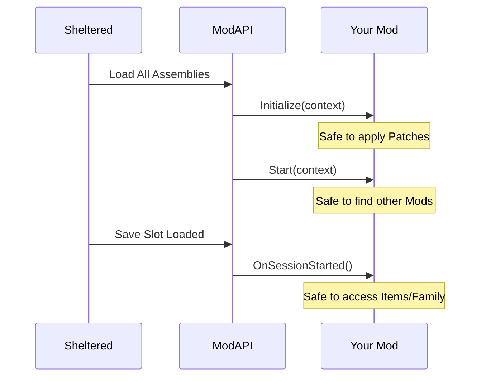
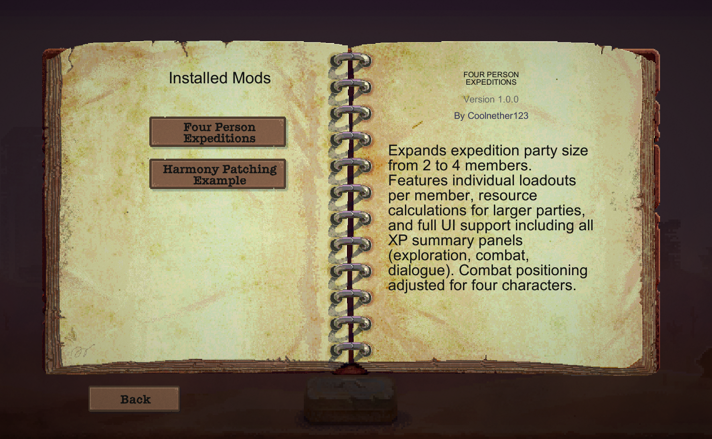
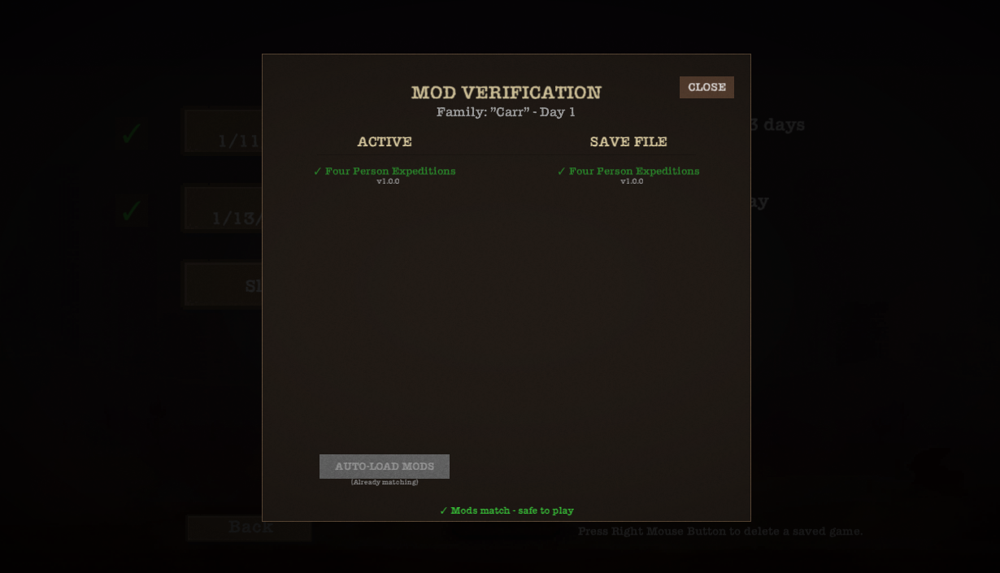

# ModAPI V1.2: Developer Guide
## First Edition (V1)

A practical guide covering how to use the ModAPI to create mods for Sheltered.

> **API Status Note:** The Developer API is in early development. This guide documents both implemented and planned features.
>
> **Currently Implemented:**
> - Item and food injection (ContentInjector)
> - Custom crafting recipes
> - Event subscriptions (OnNewDay, OnBeforeSave, OnAfterLoad, OnNewGame (v1.0.1), OnSessionStarted (v1.0.1), UI panel events)
> - In-Game Mod Settings (ModAttributes, ModManagerBase) (v1.2.0)
> - Improved Save System (ModPersistenceData, RegisterModData) (v1.2.0)
> - Dictionary Persistence (SaveLoadDictionary) (v1.2.0)
> - Logging (scoped logging v1.1.0)
> - Inter-mod communication (ModEventBus, ModRegistry)
> - Runtime Inspector (F9)
>
> **Planned for future updates:**
> - Full PartyHelper and character manipulation
> - Combat encounter events
> - Quest system hooks
> - Advanced UIFactory helpers
>
> When in doubt, check the actual ModAPI classes for current capabilities.

---

## Table of Contents

1. [Getting Started](#getting-started)
2. [ModAPI Architecture & Managers](ModAPI_Architecture_guide.md)
3. [Lifecycle & State Diagrams](#lifecycle--state-diagrams)
4. [Adding Custom Items](#adding-custom-items)
5. [Adding Crafting Recipes](#adding-crafting-recipes)
6. [Inventory Management](#inventory-management)
7. [Party & Characters](#party--characters)
8. [Game Events](#game-events)
9. [UI Events](#ui-events)
10. [Creating UI Elements](#creating-ui-elements)
11. [Mod-to-Mod Compatibility](#mod-to-mod-compatibility-guide)
12. [Save System Integration](#save-system-integration)
13. [Persistent Data](#persistent-data)
14. [Logging](#logging)
15. [Performance Pitfalls](#the-performance-pitfalls-section)
16. [Asset Loading](#asset-loading)
17. [Zero-Boilerplate Mods](#zero-boilerplate-mods)
18. [Mod Settings (Attributes)](#mod-settings-attributes)
19. [Mod Settings (Spine)](#mod-settings-spine)

---

## Getting Started

### Understanding Sheltered's Architecture

For a deep dive into how the ModAPI itself is structured (PluginManager, ModManagerBase, etc.), see the [ModAPI Architecture & Managers Guide](ModAPI_Architecture_guide.md).

Sheltered uses a **manager-based singleton pattern**. The game has centralized managers for each system:

- **ItemManager** - Holds all item definitions (prefab-based, loaded from `Resources/ItemDefs`)
- **InventoryManager** - Global shelter inventory (not per-character)
- **CraftingManager** - Recipes and crafting jobs
- **FamilyManager** - All family members and their states
- **FoodManager/WaterManager** - Specialized resource storage (separate from inventory)
- **SaveManager** - XML-based save/load orchestration

The ModAPI provides safe wrappers around these managers so you don't have to patch them directly.

### Required Namespaces

```csharp
using ModAPI.Core;       // Always needed - plugin interface, logging
using ModAPI.Content;    // Custom items, recipes, assets
using ModAPI.Items;      // Inventory helpers
using ModAPI.Characters; // Party management
using ModAPI.Events;     // Game and UI events
using ModAPI.Saves;      // Save system hooks
using ModAPI.UI;         // UI element creation
using ModAPI.Util;       // Utilities, persistent data
```

### Basic Mod Structure (Modern - v1.2.0)

Using `ModManagerBase` handles much of the boilerplate for you:

```csharp
using ModAPI.Core;
using UnityEngine;

namespace MyMod
{
    // Inherit from ModManagerBase for automatic lifecycle and system access
    public class MyModManager : ModManagerBase
    {
        // Use attributes to auto-create settings UI (v1.2.0)
        [ModToggle("Enable Boost", "Increases movement speed")]
        public bool SpeedBoost = true;

        [ModSlider("Multiplier", 1f, 5f)]
        public float Multiplier = 1.5f;

        public override void Initialize(IPluginContext context)
        {
            base.Initialize(context); // REQUIRED: Auto-binds settings/config
            Log.Info("My mod is starting up!"); // Automatically prefixed with [MyMod]
        }
        
        // This is now public virtual, satisfying ISettingsProvider
        public override void OnSettingsLoaded()
        {
            // Settings have been loaded from disk
            Log.Info($"New speed setting: {SpeedValue}");
        }

        private void Update()
        {
            if (SpeedBoost && Input.GetKeyDown(KeyCode.B))
            {
                // Access game systems via Context.Game
                var player = Context.Game.FindMember("char_father");
                if (player != null) Log.Info("Father found!");
            }
        }
    }
}
```

### Basic Mod Structure (Manual)

```csharp
using ModAPI.Core;

namespace MyMod
{
    public class MyModPlugin : IModPlugin
    {
        public void Initialize(IPluginContext context)
        {
            // Called once when mod is loaded
        }

        public void Start(IPluginContext context)
        {
            // context.Log automatically prefixes with your Mod ID
            context.Log.Info("My mod started!");
        }
    }
}
```

**The `context` parameter:** This is your mod's connection to the ModAPI. Use `context.Log` for logging and `context.Mod` for your mod's metadata (ID, name, version, folder path). Version v1.0.1 introduced `context.Game`, a high-level helper for game state.

---

## Lifecycle & State Diagrams

Understanding when things happen is crucial for preventing "Null Reference" errors during startup or data loss during saves.

### 1. Initialization Lifecycle

| Phase | Method | What's safe to do? |
|---|---|---|
| **Registration** | `Initialize(context)` | Basic setup. Harmony patching. `RegisterAPI`. |
| **Activation** | `Start(context)` | Cross-mod communication via `ModRegistry` or `ModAPIRegistry`. |
| **Session Start** | `OnSessionStarted` | Accessing `GameModeManager` or `FamilyManager`. (User is in-game). |
| **New Game** | `OnNewGame` | Resetting mod data specifically for a fresh world. |



### 2. Save/Load Lifecycle

| Action | Method | Purpose |
|---|---|---|
| **Saving** | `OnBeforeSave(entry)` | Move runtime state into serializable objects. |
| **Saving** | `Mod Persistence` | ModAPI writes `mod_data.json` to the slot folder. |
| **Loading** | `Mod Persistence` | ModAPI reads `mod_data.json` and populates objects. |
| **Loading** | `OnAfterLoad(entry)` | Re-initialize cache or runtime logic based on loaded data. |

---

## Adding Custom Items

**Namespace:** `using ModAPI.Content;`

### Why Use ContentInjector?

Sheltered loads items from prefabs via `Resources.LoadAll<ItemDefinition>("ItemDefs")` during `ItemManager.Awake()`. The game uses the `ItemType` enum (an integer) as the item ID - there are no string IDs for items.

`ContentInjector` handles the complexity of:
- Injecting your item into `ItemManager`'s dictionaries
- Ensuring your item appears in crafting/storage/trading UIs
- Making sure saves reference your item correctly

Without it, you'd need multiple Harmony patches to different managers.

### Basic Item Registration

```csharp
public void Start(IPluginContext context)
{
    var itemDef = new ItemDefinition
    {
        Name = "Power Cell",
        Description = "A high-capacity energy cell",
        Category = ItemManager.ItemCategory.Normal,
        Icon = AssetLoader.LoadSprite("power_cell.png"),
        ScrapValue = 5,      // Recycling value
        StackSize = 10,      // Max stack in inventory
        CraftStackSize = 1   // Amount produced when crafted
    };
    
    ContentInjector.RegisterCustomItem(ItemType.Custom_PowerCell, itemDef);
    
    context.Log.Info("Power Cell registered");
}
```

### Item Properties Reference

These properties map directly to fields in Sheltered's `ItemDefinition` class:

| Property | Type | Description | Game Usage |
|----------|------|-------------|------------|
| `Name` | string | Display name | UI labels, tooltips |
| `Description` | string | Tooltip text | ItemButtonBase tooltip |
| `Category` | ItemCategory | Normal, Food, Tool, Weapon, etc. | Routing in InventoryManager |
| `Icon` | Sprite | Item sprite | ItemButtonBase.UpdateSprite |
| `ScrapValue` | int | Recycling value | RecyclingPanel calculations |
| `TradeValue` | int | Trading value | TradingPanel pricing |
| `StackSize` | int | Max stack in inventory | InventoryManager stacking logic |
| `CraftStackSize` | int | Amount produced when crafted | CraftingManager output |
| `BaseCraftTime` | float | Seconds to craft | Job_Craft duration |
| `BaseFabricationTime` | float | Seconds to fabricate | Obj_ItemFabricator |
| `FabricationCost` | int | Scrap cost to fabricate | Required scrap amount |

### Food Items

Food items route to `FoodManager` instead of `InventoryManager`. When you call `InventoryManager.AddExistingItem` with a food item, the game automatically redirects it to `FoodManager.AddRations`.

```csharp
var foodDef = new ItemDefinition
{
    Name = "Super Ration",
    Description = "A highly nutritious meal",
    Category = ItemManager.ItemCategory.Food,
    Icon = AssetLoader.LoadSprite("super_ration.png"),
    RationValue = 50,      // Hunger restored (feeds into FoodManager)
    IsRawFood = false,     // If true, needs cooking first
    CookingResult = ItemType.None  // What it becomes when cooked
};
```

### Combat Items

Combat-capable items need additional properties from `ItemDefinition_Combat`:

```csharp
var weaponDef = new ItemDefinition
{
    Name = "Plasma Rifle",
    Description = "Advanced energy weapon",
    Category = ItemManager.ItemCategory.Weapon,
    CanUseInCombat = true,
    // Combat stats go in ItemDefinition_Combat
};
```

---

## Adding Crafting Recipes

**Namespace:** `using ModAPI.Content;`

### Why Use ContentInjector for Recipes?

Sheltered's `CraftingManager` holds recipes in serialized inspector lists, not external files. Recipes are filtered by `CraftLocation` (Workbench, Lab, AmmoPress) and level.

`ContentInjector.RegisterCustomRecipe` injects your recipe into the manager's dictionaries so it appears in the appropriate crafting UI.

### Basic Recipe

```csharp
var recipe = new CraftingManager.Recipe
{
    ID = "mymod_power_cell",           // String ID (unique)
    Result = ItemType.Custom_PowerCell,
    Ingredients = new List<ItemStack>
    {
        new ItemStack(ItemType.Component, 3),
        new ItemStack(ItemType.Metal, 2)
    },
    CraftTime = 45f,  // Seconds (modified by tools and traits)
    CraftingStation = ObjectManager.ObjectType.Workbench
};

ContentInjector.RegisterCustomRecipe(recipe);
```

### Recipe Properties

| Property | Type | Description |
|----------|------|-------------|
| `ID` | string | Unique recipe identifier |
| `Result` | ItemType | What gets produced |
| `ResultCount` | int | How many are produced (default: 1) |
| `Ingredients` | List<ItemStack> | Required inputs |
| `CraftTime` | float | Base seconds (multiplied by tool count via `CalculateCraftTime`) |
| `CraftingStation` | ObjectType | Workbench, Lab, or AmmoPress |
| `Level` | int | Station level required (1-5) |
| `Locked` | bool | If true, must be unlocked first |

### Crafting Stations

```csharp
ObjectManager.ObjectType.Workbench  // General crafting
ObjectManager.ObjectType.Lab        // Requires Intelligence >= 10
ObjectManager.ObjectType.AmmoPress  // Ammunition
```

**Note:** Lab crafting checks `member.Intelligence < 10` in `InteractionInstance_Craft` and blocks if too low.

---

## Inventory Management

**Namespace:** `using ModAPI.Items;`

### Why Use InventoryHelper?

Sheltered's inventory system is more complex than it appears:

- **Global inventory** - `InventoryManager.m_Inventory` is a dictionary of `ItemType -> List<ItemInstance>`
- **Special routing** - Food, Water, Tools, Entertainment, and Meat bypass inventory and go directly to their respective managers
- **Stack limits** - `ItemDefinition.StackSize` enforces maximum stack size
- **Storage capacity** - `Obj_Storage` objects increase `InventoryManager.storageCapacity`

`InventoryHelper` handles this routing and validation so you don't accidentally break the economy.

### Adding Items

```csharp
// Add single item
InventoryHelper.AddItem(ItemType.Custom_PowerCell);

// Add multiple
InventoryHelper.AddItems(ItemType.Custom_PowerCell, 5);

// Check if room available first
if (InventoryHelper.CanAddItem(ItemType.Custom_PowerCell, 10))
{
    InventoryHelper.AddItems(ItemType.Custom_PowerCell, 10);
}
```

### Removing Items

```csharp
// Check before removing (prevents negative counts)
if (InventoryHelper.HasItems(ItemType.Metal, 3))
{
    InventoryHelper.RemoveItems(ItemType.Metal, 3);
}
```

### Querying Inventory

```csharp
int metalCount = InventoryHelper.GetItemCount(ItemType.Metal);
bool hasMetal = InventoryHelper.HasItem(ItemType.Metal);
bool hasEnough = InventoryHelper.HasItems(ItemType.Metal, 5);
```

### Unified Game State (v1.0.1)
**Namespace:** `using ModAPI.Core;`

Accessed via `context.Game`, this interface provides high-level helpers for game state that usually requires polling multiple internal managers.

```csharp
// Get total count of items across ALL managers (Inventory, Food, Water, Entertainment)
int totalWood = context.Game.GetTotalOwned("wood");
int totalRations = context.Game.GetTotalOwned("rations");

// Find a person in the family by ID
var member = context.Game.FindMember("char_father");
```

---

## Party & Characters

**Namespace:** `using ModAPI.Characters;`

### Understanding Sheltered's Character System

- **FamilyMember** - A person in your shelter, tracked by `FamilyManager`
- **PartyMember** - A wrapper around FamilyMember with equipment slots (weapon, items, gas mask)
- **ExplorationParty** - A group of PartyMembers on an expedition

Characters have two stat systems:
- **BaseStats** - Strength, Dexterity, Intelligence, Charisma, Perception (with XP/levels)
- **BehaviourStats** - Fatigue, hunger, thirst, dirtiness, stress, toilet (needs)

`FamilyAI` drives automated actions based on `BehaviourStats` thresholds.

### Party Events

```csharp
public void Start(IPluginContext context)
{
    PartyHelper.OnPartyCompositionChanged += OnPartyChanged;
}

private void OnPartyChanged(PartyChangedEventArgs args)
{
    MMLog.Info($"Party changed! Members: {args.CurrentCount}");
    
    if (args.AddedMember != null)
        MMLog.Info($"Added: {args.AddedMember.GetName()}");
    
    if (args.RemovedMember != null)
        MMLog.Info($"Removed: {args.RemovedMember.GetName()}");
}
```

### Querying Characters

```csharp
// Get expedition party members
var partyMembers = PartyHelper.GetExpeditionMembers();

// Get all family members (including dead/unconscious)
var allMembers = PartyHelper.GetAllFamilyMembers();

// Get available members (not on a job, not unconscious)
var available = PartyHelper.GetAvailableMembers();
```

---

## Game Events

**Namespace:** `using ModAPI.Events;`

### Why Use GameEvents?

Sheltered has **no centralized event bus**. Events are scattered across managers as C# delegates:
- `GameTime.newDay` / `GameTime.newWeek`
- `InventoryManager.onToolAdded` / `onToolRemoved`
- `SaveManager.onGlobalDataLoaded` / `onSlotDataLoadFinished`
- `ExplorationManager.onPartyReturned`

`GameEvents` consolidates the most useful events into one place with consistent naming and safe invocation.

### Available Events

```csharp
// Day cycle (from GameTime.newDay)
GameEvents.OnNewDay += (int dayNumber) => 
{
    MMLog.Info($"Day {dayNumber} started");
};

// Save/Load hooks
GameEvents.OnBeforeSave += (SaveData data) => 
{
    // Prepare your mod for save
};

GameEvents.OnAfterLoad += (SaveData data) => 
{
    // Restore your mod state after load
};

// Combat started
GameEvents.OnCombatStarted += (EncounterCharacter player, EncounterCharacter enemy) => 
{
    MMLog.Info($"Combat: {player.GetName()} vs {enemy.GetName()}");
};

// Expedition returned (from ExplorationManager.onPartyReturned)
GameEvents.OnPartyReturned += (ExplorationParty party) => 
{
    MMLog.Info("Expedition returned with loot!");
};

// Session Lifecycle (v1.0.1)
GameEvents.OnSessionStarted += () => {
    MMLog.Info("A new play session (load or new game) has started.");
};

GameEvents.OnNewGame += () => {
    MMLog.Info("A brand new game is being initialized!");
};
```

### Lifecycle Interface (v1.0.1)
Alternatively, plugins can implement `IModSessionEvents` for cleaner state management:

```csharp
public class MyMod : IModPlugin, IModSessionEvents
{
    public void OnSessionStarted() {
        // Safe to re-initialize manager state here
    }
    
    public void OnNewGame() {
        // Reset persistent variables for a fresh save
    }
}
```

### Best Practices

```csharp
public class MyMod : IModPlugin
{
    private Action<int> _dayHandler;
    
    public void Start(IPluginContext context)
    {
        // Store reference for cleanup
        _dayHandler = OnDayChanged;
        GameEvents.OnNewDay += _dayHandler;
    }
    
    private void OnDayChanged(int day)
    {
        try
        {
            // Your logic here
            ProcessNewDay(day);
        }
        catch (Exception ex)
        {
            // Always catch exceptions in event handlers
            // A crash here could break other mods
            MMLog.WriteWarning($"Error in day handler: {ex.Message}");
        }
    }
}
```

---

## UI Events


**Namespace:** `using ModAPI.Events;`

### Why Use UIEvents?

Sheltered's UI uses a panel stack system via `UIPanelManager`:
- `PushPanel` adds a panel to the stack
- `PopPanel` removes the top panel
- `BasePanel.OnShow/OnHide/OnClose` handle lifecycle

`UIEvents` patches these methods so you can react to panel changes without writing your own Harmony patches.

### Panel Lifecycle

```csharp
// Panel pushed onto stack
UIEvents.OnPanelOpened += (BasePanel panel) => 
{
    string panelName = panel.GetType().Name;
    MMLog.Info($"Opened: {panelName}");
    
    if (panelName == "CraftingPanel")
    {
        ShowCraftingHelper();
    }
};

// Panel popped from stack
UIEvents.OnPanelClosed += (BasePanel panel) => 
{
    CleanupCustomUI();
};

// Panel returned to top (another panel closed above it)
UIEvents.OnPanelResumed += (BasePanel panel) => 
{
    RefreshUI();
};

// Another panel pushed above this one
UIEvents.OnPanelPaused += (BasePanel panel) => 
{
    PauseAnimations();
};
```

### Common Panel Names

```
MainMenuPanel       - Pause/options menu
CraftingPanel       - Crafting station UI
InventoryPanel      - Shelter inventory
StoragePanel        - Storage container UI
TradingPanel        - Trading with NPCs
ItemTransferPanel   - Moving items between party/shelter
CharacterPanel      - Character status/stats
MapPanel            - Expedition map
SlotSelectionPanel  - Save slot selection
```

---

## Creating UI Elements

**Namespace:** `using ModAPI.UI;`

### Why Use UIFactory?

Sheltered uses **NGUI** (not Unity UI). Creating UI elements requires:
- Setting up atlases and sprites correctly
- Managing depth and panel layering
- Hooking into NGUI's event system

`UIFactory` provides pre-configured element creation that matches the vanilla style.

### Button Creation

```csharp
// Simple icon button
var button = UIFactory.CreateIconButton(
    parent: parentTransform,
    iconSprite: mySprite,
    onClick: () => DoSomething()
);

// Arrow navigation button
var leftArrow = UIFactory.CreateArrowButton(
    parent: parentTransform,
    direction: Direction.Left,
    onClick: () => PreviousPage()
);

// Complex element with tooltip
var element = UIFactory.CreateInteractiveElement(new UIElementOptions
{
    Parent = parentTransform,
    Sprite = mySprite,
    Label = "Click Me",
    OnClick = DoSomething
});
```

### Finding UI Elements

```csharp
// Find a panel by name
var panel = UIHelper.FindPanel("CraftingPanel");

// Find child element within a panel
var button = UIHelper.FindChild(panel, "CraftButton");

// Get component from GameObject
var label = UIHelper.GetComponent<UILabel>(someObject);
```

---

## Save System Integration


**Namespace:** `using ModAPI.Saves;`

### Why Hook Into Saves?

Sheltered uses XML-based saves via `SaveData` and `SaveManager`. The save flow:
1. `StartSave` iterates all `ISaveable` objects
2. Each calls `SaveLoad(saveData, saving: true)`
3. Data is XOR-encrypted and written to `saves/<slot>.dat`

Loading reverses this, with dependency ordering via `IsReadyForLoad`.

If your mod needs to persist data per-save (not global settings), hook into these events.

### Save Events

**Note:** For simple data persistence, use the new `RegisterModData` method detailed in the "Improved Save System" section below. This manual method is for advanced use cases only.

```csharp
public void Start(IPluginContext context)
{
    ModAPI.Saves.Events.OnBeforeSave += OnBeforeSave;
    ModAPI.Saves.Events.OnAfterLoad += OnAfterLoad;
}

private void OnBeforeSave(SaveEntry saveEntry)
{
    // Get the correct path for this slot
    string folder = DirectoryProvider.SlotRoot(saveEntry.scenarioId, saveEntry.absoluteSlot);
    string path = Path.Combine(folder, "mymod_data.json");
    
    File.WriteAllText(path, JsonUtility.ToJson(_myData));
}

private void OnAfterLoad(SaveEntry saveEntry)
{
    string folder = DirectoryProvider.SlotRoot(saveEntry.scenarioId, saveEntry.absoluteSlot);
    string path = Path.Combine(folder, "mymod_data.json");
    
    if (File.Exists(path))
    {
        _myData = JsonUtility.FromJson<MyData>(File.ReadAllText(path));
    }
    else
    {
        _myData = new MyData();
    }
}
```

---

## Persistent Data

**Namespace:** `using ModAPI.Util;`

### When to Use PersistentDataAPI

Use this for **global mod settings** that persist across ALL saves:
- User preferences
- Mod configuration
- Unlockables that shouldn't reset

Do NOT use for per-save game data (use Save Events instead).

### Save/Load Settings

```csharp
public class MyModSettings
{
    public bool EnableFeatureX = true;
    public float DifficultyMultiplier = 1.0f;
    public string LastUsedPreset = "default";
}

// Save
PersistentDataAPI.SaveData("MyMod.Settings", _settings);

// Load
_settings = PersistentDataAPI.LoadData<MyModSettings>("MyMod.Settings");
if (_settings == null)
{
    _settings = new MyModSettings();  // Defaults
}

// Delete
PersistentDataAPI.DeleteData("MyMod.Settings");
```

---

## Logging

**Namespace:** `using ModAPI.Core;`

### Smart Source Attribution (v1.2.0)

The logging system now uses **Automatic Source Detection**. You should no longer manually prefix your messages with `[MyMod]` or `[Class]`. 

- **Mod Logs**: `context.Log.Info("Hello")` → `[INFO ] [MyMod.Id] Hello`
- **Internal Logs**: `MMLog.Write("System starting")` → `[INFO ] [InternalClassName] System starting`

This ensures logs are clean, consistent, and easy to filter.

### Performance Timing & Static Logger

```csharp
// Get a static logger instance (useful for static classes)
private static readonly IModLogger _staticLog = ModLog.GetLogger();

public static void MyStaticHelper()
{
    _staticLog.Info("This logs with the correct mod prefix automatically");
}

// Measure performance
MMLog.StartTimer("HeavyOperation");
// ... do expensive work ...
MMLog.StopTimer("HeavyOperation");
```


---

## Asset Loading

**Namespace:** `using ModAPI.Content;`

### Loading Sprites

Sheltered uses NGUI atlases for UI sprites. For custom items, you need standalone sprites:

```csharp
// Load from your mod's Assets folder
Sprite icon = AssetLoader.LoadSprite("my_icon.png");

// With subfolder path
Sprite sprite = AssetLoader.LoadSprite("icons/sword.png");
```

### Mod Folder Structure

```
mods/
└── MyMod/
    ├── About/
    │   └── About.json      # Mod metadata (required)
    ├── Assemblies/
    │   └── MyMod.dll       # Your compiled mod
    └── Assets/
        ├── my_icon.png     # Custom sprites
        └── icons/
            └── sword.png
```

---

## Redundant Inter-Mod section

For advanced mods that need to interact with other mods.

### Checking if a Mod is Installed

```csharp
using ModAPI.Core;

// Simple check
if (ModRegistry.Find("OtherAuthor.SomeMod"))
{
    // Enable optional integration features
    EnablePartnerModIntegration();
}

// Get mod info
ModEntry mod = ModRegistry.GetMod("OtherAuthor.SomeMod");
if (mod != null)
{
    MMLog.Info($"Found: {mod.Name} v{mod.Version}");
}

// List all loaded mods
foreach (string modId in ModRegistry.GetLoadedModIds())
{
    MMLog.Info($"Loaded: {modId}");
}
```

### Publishing Events for Other Mods

Allow other mods to react to things your mod does:

```csharp
using ModAPI.Events;

// Define your event data
public class QuestCompletedData
{
    public string QuestId;
    public int Reward;
}

// Publish when something happens
public void CompleteQuest(string questId, int reward)
{
    // Your logic...
    
    // Let other mods know
    ModEventBus.Publish("MyName.MyMod.QuestCompleted", new QuestCompletedData
    {
        QuestId = questId,
        Reward = reward
    });
}
```

### Subscribing to Other Mods' Events

```csharp
ModEventBus.Subscribe<QuestCompletedData>("OtherMod.QuestCompleted", data => 
{
    MMLog.Info($"Other mod completed quest: {data.QuestId}");
    GiveBonusReward(data.Reward / 10);
});
```

### Sharing an API

For complex mod-to-mod integration:

```csharp
// Define interface
public interface IMyAPI
{
    void RegisterCustomQuest(string id, QuestData data);
    bool HasQuest(string id);
}

// Register implementation
ModAPIRegistry.RegisterAPI<IMyAPI>("com.myname.MyAPI", new MyAPIImpl());

// Consume from another mod
if (ModAPIRegistry.TryGetAPI<IMyAPI>("OtherMod.API", out var api))
{
    api.RegisterCustomQuest("bonus_quest", myQuestData);
}
```

### Mod-to-Mod Compatibility Guide
 
 ModAPI provides three ways to interact with other mods, ranked from "Loose" to "Tight" coupling.
 
 #### 1. Discovery (Loose)
 Check if a mod exists before enabling optional features. No hard reference to their DLL is needed.
 
 ```csharp
 if (ModRegistry.Find("Author.SomeExpansion")) {
    EnableCompatibilityLayer();
 }
 ```
 
 #### 2. Event Bus (Medium)
 Broadcast data that any mod can listen to. High performance and zero coupling (you don't need their interface).
 
 ```csharp
 // Publisher
 ModEventBus.Publish("MyMod.TradeCompleted", new TradeData { Amount = 50 });
 
 // Subscriber
 ModEventBus.Subscribe<TradeData>("MyMod.TradeCompleted", data => ...);
 ```
 
 #### 3. API Registry (Tight)
 Expose a full C# interface for other mods to call.
 
 ```csharp
 // 1. Put your interface in a 'Shared' namespace or separate DLL
 public interface IMarketplaceAPI {
    void RegisterVendor(GameObject npc);
 }
 
 // 2. Register it
 ModAPIRegistry.RegisterAPI<IMarketplaceAPI>("com.author.Market", myImplementation);
 
 // 3. Mod B calls it
 if (ModAPIRegistry.TryGetAPI<IMarketplaceAPI>("com.author.Market", out var api)) {
    api.RegisterVendor(myNPC);
 }
 ```
 
 ---
 
 ## "The Performance Pitfalls" Section
 
 Sheltered runs on a version of Unity 5.x that is highly sensitive to main-thread processing time.
 
 ### 1. Avoid `GameObject.Find` in `Update()`
 `GameObject.Find` and `GetComponent` are expensive. 
 *   **Wrong**: Searching for the player every frame in `Update`.
 *   **Right**: Cache the reference during `OnSessionStarted` or use `context.Game.FindMember()`.
 
 ### 2. Logging Optimization
 `MMLog` is highly optimized, but a stack-walk (to find the source name) still takes time.
 *   **Wrong**: Logging "Still processing..." inside a loop that runs 500 times.
 *   **Right**: Use `MMLog.WriteWithSource("Message", "MySource")` in hot loops to bypass the expensive source detection.
 
 ### 3. Tick Management
 Not everything needs to happen in `Update()` (60-120 times per second).
 *   **Pro Tip**: Use `GameEvents.OnNewDay` for systems that only update once a day (inventory decay, reputation changes).
 *   **Pro Tip**: If you need a "slower" update, check `Time.frameCount % 60 == 0` to run logic only once per second.
 
 ---

## Quick Reference

### Choosing the Right Namespace

| What You Want To Do | Namespace |
|---------------------|-----------|
| Add custom items | `ModAPI.Content` |
| Add crafting recipes | `ModAPI.Content` |
| Manipulate inventory | `ModAPI.Items` |
| React to game events | `ModAPI.Events` |
| React to UI panels | `ModAPI.Events` |
| Create UI elements | `ModAPI.UI` |
| Save per-game data | `ModAPI.Saves` |
| Save global settings | `ModAPI.Util` |
| Work with parties | `ModAPI.Characters` |
| Log messages | `ModAPI.Core` |
| Check for other mods | `ModAPI.Core` |

---

*Sheltered Mod Loader v1.2.0*
---

## Mod Settings (Spine)

Spine is the recommended way to handle mod configuration. It uses C# attributes to automatically generate a professional UI for your mod.

For full details, see the dedicated guide: [Spine Settings API Guide](Spine_Settings_Guide.md)

### Quick Example

```csharp
public class MySettings {
    [ModSetting("Flashlight Power", MinValue = 1f, MaxValue = 10f)]
    public float FlashPower = 1.0f;
}

public class MyMod : IModPlugin, ISettingsProvider {
    // Implement ISettingsProvider to enable Spine
}
```

---

## Zero-Boilerplate Mods (v1.2.0)

`ModManagerBase` is a new base class that inherits from `MonoBehaviour` and automatically handles common modding tasks. By inheriting from it, you get:

- **Automatic Settings Binding**: Fields marked with `ModAttributes` are automatically linked to the UI and persisted to JSON.
- **Convenience Accessors**: `Log`, `SaveSystem`, `Settings`, and `Context` are available as protected properties.
- **Unity Lifecycle**: Standard `Update`, `FixedUpdate`, `OnDestroy` etc. work like any other script.
- **Automatic Registration**: The loader automatically finds and attaches your manager to a root object.

### Example

```csharp
public class MyMod : ModManagerBase {
    [ModToggle("Toggle Me")]
    public bool MyValue;

    public override void Initialize(IPluginContext ctx) {
        base.Initialize(ctx); // Binds MyValue to the UI
    }
}
```

---

## Mod Settings (Attributes)

As of v1.2.0, you can use built-in attributes for simpler settings management without implementing `ISettingsProvider`.

| Attribute | Usage |
|-----------|-------|
| `[ModToggle("Label")]` | Creates a boolean switch. |
| `[ModSlider("Label", min, max)]` | Creates a numeric slider. |

These work with `ModManagerBase.Initialize()` or by calling `context.Settings.AutoBind(this)`.

---

## Improved Save System (v1.2.0)

The save system has been upgraded to support per-mod isolated data files and easy dictionary persistence.

### Registering Mod Data
Instead of handling file IO manually in `OnBeforeSave`, you can register a data object:

```csharp
public class MyData { public string Name; public int Level; }
// ...
var data = new MyData();
context.SaveSystem.RegisterModData("my_stats", data);
```

The ModAPI will automatically:
1. Save `data` to `mod_<id>_data.json` in the active save slot folder.
2. Load and overwrite the object fields when the save is loaded.

### Dictionary Persistence
For modders needing to save dynamic key-value pairs (like world markers or quest progress), use `SaveLoadDictionary<TKey, TValue>`.

```csharp
using ModAPI.Util;

public class MyMod : ModManagerBase {
    private SaveLoadDictionary<string, int> _reputation = new SaveLoadDictionary<string, int>();

    public override void Initialize(IPluginContext ctx) {
        base.Initialize(ctx);
        // Register it so it's auto-saved/loaded
        RegisterPersistentData("reputation", _reputation);
    }
}
```

This dictionary is JSON-serializable and maintains its state across restarts when using `RegisterModData` or `RegisterPersistentData`.

---

## Deterministic Randomness (ModRandom) (v1.2.0)

ModAPI includes a high-performance, deterministic random number generator base on the **XorShift64*** algorithm. This ensures that random results are identical across different platforms (Steam vs Epic) and .NET runtimes, which is essential for synchronized gameplay and preventing "save-scumming."

### Mod-Isolated Random Streams
When using `ModManagerBase`, each mod gets its own `Random` stream. This prevents "RNG stealing"—where one mod's random calls would otherwise advance the master seed and change the results for other mods.

```csharp
public class MyMod : ModManagerBase {
    public void SpawnLoot() {
        // Scoped specifically to this mod
        int roll = this.Random.Range(1, 100);
        
        bool success = this.Random.Bool(0.15f); // 15% chance
        
        float variance = this.Random.Gaussian(10f, 2f); // Bell curve
        
        string quest = this.Random.Choose("Find Water", "Fix Generator", "Scout Radio");
    }
}
```

### Static ModRandom API
For code outside of a ModManager, use the global static API:

```csharp
using ModAPI.Core;

// Basic ranges
int age = ModRandom.Range(18, 65);
float health = ModRandom.Range(0.0f, 1.0f);

// Weighted selection
var items = new[] { "Common", "Rare", "Legendary" };
var weights = new[] { 0.80f, 0.15f, 0.05f };
string result = ModRandom.Weighted(items, weights);

// Shuffling
List<string> characters = GetAllCharacters();
ModRandom.Shuffle(characters);

// High-precision ranges
int largeVal = ModRandom.RangeUnbiased(0, int.MaxValue); // Eliminates modulo bias
```

### Best Practices: ModRandom vs Unity Random
You should **always prefer `ModRandom` over `UnityEngine.Random` or `System.Random`** for gameplay logic.

| Feature | ModRandom | UnityEngine.Random | System.Random |
| :--- | :--- | :--- | :--- |
| **Deterministic** | ✅ Yes (Fixed Seed) | ❌ No | ❌ No |
| **Cross-Platform** | ✅ Identical results | ❌ Varies by OS/Version | ❌ Varies by Runtime |
| **Thread Safe** | ✅ Yes | ❌ No (Main Thread Only) | ❌ No |
| **Distribution** | ✅ Uniform / Gaussian | ⚠️ Uniform Only | ⚠️ Poor Quality |

Use `ModRandom.RangeUnbiased(min, max)` when generating from very large ranges (e.g. `0` to `int.MaxValue`) to avoid the slight modulo bias present in standard RNGs.

### Save Persistence & Determinism
By default, **ModAPI generates a brand new master seed every time you load into a save.** This ensures that gameplay feels fresh and unscripted on every session.

However, if your mod requires absolute session-to-session determinism (e.g. for multiplayer sync or specific puzzle logic), you can disable this behavior:

```csharp
// Inside your mod's Start() or Initialize()
ModRandom.IsDeterministic = true;
```

When `IsDeterministic` is set to `true`, the RNG will:
1.  Restore the exact `MasterSeed` that was used when the save was created/last saved.
2.  Restore the exact `StepCount`, fast-forwarding the RNG to its previous position.
3.  Store this setting in the save slot's `seed.json` so it persists for that specific game.

**Example `seed.json` (inside slot folder):**
```json
{
    "masterSeed": 123456789,
    "stepCount": 420,
    "isDeterministic": true
}
```

Once a mod sets `ModRandom.IsDeterministic = true` and the game is saved, that save slot is essentially "frozen" to use its seed. This setting is sticky; it will remain deterministic for all future sessions until a mod explicitly sets it back to `false` or the JSON file is modified manually.
