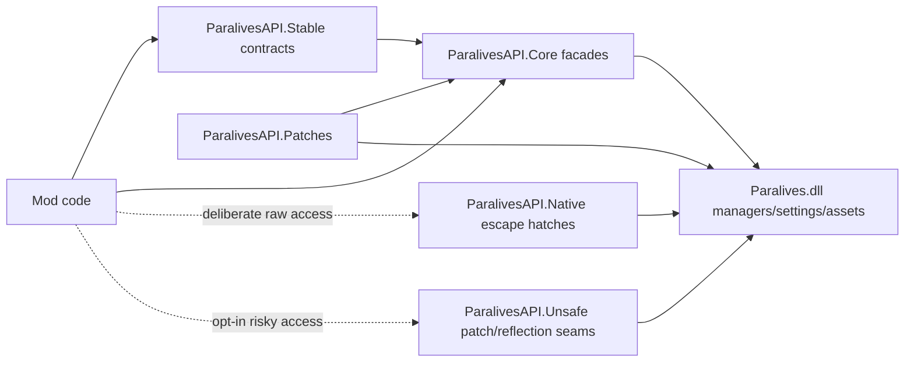
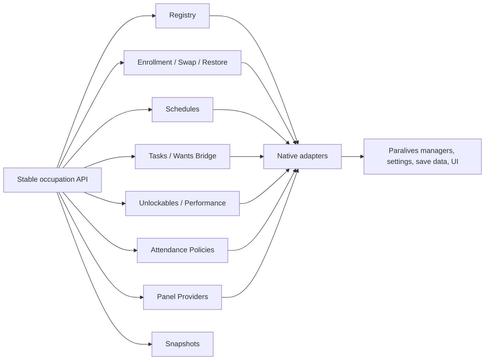

# Paralives API Seams

> **Build/reference metadata**
> Research note created/reviewed: 2026-05-30.
> Game build represented: local Paralives managed assemblies from A:\SteamLibrary\steamapps\common\Paralives, DLL timestamps 2026-05-29 UTC.
> Assembly fingerprint: Assembly-CSharp.dll SHA256 885D46DF..., Paralives.dll SHA256 BEE83983..., Plugins.dll SHA256 311E9ED9.... Full hashes are in Decompiled/decompile-state.json.
> Metadata added: 2026-05-30.

Date reviewed: 2026-05-29

Scope: `ParalivesAPI`, current Paralives research notes, and the proposed facade split for the Paralives API refactor. This document describes current facts and planned seams. Proposed items are not public API until code lands.

## Current Runtime Shape

`ParalivesAPI.dll` is a game-specific runtime assembly. It references `Paralives.dll`, Unity, Harmony, and `ModAPI.dll`.

Startup currently flows through `ParalivesRuntimeBootstrap`, which registers `ParalivesRuntimeInfo.Current` under `GameRuntime.Paralives`, applies Harmony patches, and starts a small runtime host. The host periodically applies pending localization, interaction, and notification registrations when native settings are ready.

Agent 1 has added initial API metadata and boundary scaffolding. `ParalivesRuntimeInfo.Current` now exposes version and capability metadata, and the source tree contains initial `ParalivesAPI.Stable`, `ParalivesAPI.Native`, and `ParalivesAPI.Unsafe` namespaces. Existing concrete facades still mostly live under `ParalivesAPI.Core`.

`ParalivesRuntimeInfo.Current` exposes the current facade set:

| Area | Current facade or registry |
|------|----------------------------|
| Runtime aggregate | `Game`, `Settings`, `GameId`, `DisplayName` |
| Version and capabilities | `Version`, `ApiVersion`, `AdapterVersion`, `Capabilities`, `CapabilityStrings`, `HasCapability(...)` |
| People and player state | `People`, `Characters`, `Players` |
| Interactions and actions | `Interactions`, `Queues`, `InteractionSelections`, `ActionCompletions` |
| Occupations and attendance | `Occupations`, `AttendancePolicies`, `Windows` occupation helpers |
| Progression | `Skills`, `Wants`, `Goals`, `Needs`, `Status`, `Statuses` |
| Relationships and identity | `Relationships`, `Personality` |
| Memory and social systems | `Memories`, `Memory`, `Social`, `Together` |
| Content-adjacent registration | `Localizations`, `Notifications` |
| World and time | `World`, `Time` |

Additional public contract/model work exists in the source tree for stable interfaces, content snapshots, interaction builders, requirements, action/game lifecycle, save lifecycle/storage, UI extensions, occupation panels, patch diagnostics, and Native/Unsafe markers. Some of these are not yet exposed through `ParalivesRuntimeInfo.Current`.

Harmony patches under `ParalivesAPI/Patches` are current native seams for manager events and UI hooks. They are implementation plumbing, not a separate public authoring surface.

## Boundary Diagram



The desired direction is for ordinary mods to use Stable contracts or stable Core facades, with raw game objects isolated under Native and patch/reflection seams isolated under Unsafe.

## Current Raw Game Seams

| Seam | Native systems | Current API exposure | Notes |
|------|----------------|----------------------|-------|
| Runtime bootstrap | `Settings`, Unity scene/runtime objects, Harmony patch targets | Mostly internal, with public `ParalivesRuntimeBootstrap` for runtime discovery | Bootstrap is integration plumbing. Mods should start from `ParalivesRuntimeInfo.Current`. |
| Characters and selected players | `AssetManager`, `CharacterManager`, `PlayerManager`, `HouseholdManager`, `AssetCharacter`, `Player` | `Characters`, `Players`, `People` | Snapshot reads are safer; several `Characters` and `Players` methods intentionally return raw native objects today. |
| Interactions and action queues | `InteractionManager`, `Setting.ActionUnit`, `Setting.InteractionUnit`, `Setting.InteractionGroup`, `UIInteractionsListItem`, `UpdateCharacterActions` | `Interactions`, `Queues`, `InteractionSelections`, `ActionCompletions`, `ParalivesInteractionFactory` | Registry/factory APIs currently expose native setting types for content injection. |
| Occupations | `OccupationsManager`, `UpdateCharacterOccupations`, occupation settings, schedules, wants-backed tasks, and save data | `Occupations`, `Occupations.Registry`, `Occupations.Schedules`, `Occupations.Tasks`, `AttendancePolicies`, occupation UI helpers | The API direction is occupation-first. School is one specialization. GUID-based reads and summaries are stable-ish; native occupation data, native schedule values, and `AssetCharacter` overloads are native seams. |
| Skills, wants, goals, needs, status | `SkillManager`, `WantsManager`, `GoalsManager`, `NeedManager`, `StatusEffectManager`, `Setting.*` | `Skills`, `Wants`, `Goals`, `Needs`, `Status` | Facades validate readiness and mark character dirty where practical. Raw setting and data types still appear in some public signatures. |
| Relationships, personality, memories | `RelationshipManager`, `PersonalityManager`, `MemoryManager`, `BrainLogicManager` | `Relationships`, `Personality`, `Memories` | Snapshot reads are stable-ish. Memory data and native label/settings access are raw seams. |
| Social groups and Together cards | `SocialGroupManager`, `TogetherManager`, `TogetherCard`, `TogetherCardCategory` | `Social`, `Together` | Social groups are active gameplay state and can be reset during load. Current card registration exposes native card types. |
| Localization and notifications | `TranslationManager`, `Setting.Translations`, `NotificationManager`, notification settings | `Localizations`, `Notifications` | String translation and GUID show helpers are stable-ish. `TranslationItem`, `Notification`, and `NotificationData` are raw seams. |
| World, lots, items | `AssetManager`, `LotManager`, `ItemManager`, `AssetLot`, `ItemObjectRoot` | `World` | Current world helpers are useful but mostly native escape hatches. |
| Time | `ParaTime`, player pause/speed state | `Time` | `ParalivesTimeState` is a stable-ish snapshot shape. |
| Saves and dirty state | `GameSavingManager`, `SavedGameManager`, `AssetData.IsSaveDirty`, `Player.CanSave()` | Research only; no dedicated facade yet | See `Paralives_Save_Lifecycle_Dirty_State_Research.md`. |

## Grouped Game Systems

| System group | Owns | Primary facade owner |
|--------------|------|----------------------|
| Runtime and API registration | bootstrap, runtime aggregate, readiness checks | Runtime/API contracts agent |
| People, identity, and household membership | character lookup, selected characters, people snapshots, raw character escape hatches | Character/content facade agent |
| Interactions and actions | content registration, queue reads, injection/cancel, selection/completion events | Interaction/action seams agent |
| Occupations | jobs, schools, custom careers, clubs, apprenticeships, gigs, remote work, enrollment, attendance override, task/performance helpers | Occupation facade agent |
| Progression | skills, wants, goals, needs, status effects | API contracts plus owning gameplay facade agents |
| Relationships, personality, memories, social | relationship labels, traits, memory log, social groups, Together cards | Character/content and interaction/social facade owners |
| Content, settings, localization, notifications | generated settings reads, registered content, translations, notifications | Character/content and UI seams agents |
| World and items | lots, item lookup, spawning, future inventory/item state helpers | Character/content facade agent |
| Save lifecycle and dirty state | save status, load/save events, dirty marking | Save lifecycle agent |
| UI seams | windows, tiles, SMM mod screen bridge, notification/localization UX | UI seams agent |
| Patch governance | Harmony patch ownership, activation, diagnostics | Patch governance agent |

## Occupation Seam Direction

The occupation API is generic. It must describe the game's occupation system first, then layer school-specific behavior on top only where the native game already distinguishes school from other occupations.

Common consumers should include:

- jobs and custom careers;
- schools and education tracks;
- clubs, apprenticeships, volunteer work, and training programs;
- gigs, side work, remote work, and self-employment;
- mods that add occupation tasks, performance rows, attendance rules, or unlockables.

Do not add hardcoded Homeschool APIs. A homeschool mod should consume generic occupation APIs by combining a school occupation, attendance policy, occupation tasks, optional panel rows, and restore/snapshot state.

Current occupation-related seams:

| Seam | Current surface | Boundary |
|------|-----------------|----------|
| Occupation reads and mutations | `ParalivesRuntimeInfo.Current.Occupations` | Mixed Core surface. GUID/snapshot overloads are stable direction; raw character, native occupation data, and native schedule overloads are native seams. |
| Content snapshots | `ParalivesRuntimeInfo.Current.Content.ReadOccupation(...)` and `ReadOccupations()` | Stable-ish read snapshots over native settings. |
| Registry | `ParalivesRuntimeInfo.Current.Occupations.Registry` | Core registration path exists and maps API-owned definitions into native occupation settings. Raw setting mutation remains behind the facade. |
| Enrollment, swap, and restore | `ParalivesRuntimeInfo.Current.Occupations.Enrollment` | Structured Core facade exists for enroll, unenroll, swap, restore, and snapshots. Some overloads and DTOs still carry native schedule types. |
| Schedules | `ParalivesRuntimeInfo.Current.Occupations.Schedules` | Core registration/read facade exists; some schedule DTO properties still expose native schedule types. |
| Attendance decisions | `ParalivesRuntimeInfo.Current.AttendancePolicies` and `OccupationsManagerShouldBeWorkingNowPatch` | Generic attendance override for any occupation. Current context still exposes raw native objects and schedule values. |
| Tasks bridge | `ParalivesRuntimeInfo.Current.Occupations.Tasks`, `ParalivesRuntimeInfo.Current.Wants.CreateOrRefreshOccupationWant(...)`, `Goals`, and UI task animation helpers | Current implementation is occupation-task terminology over active wants/goals. |
| Unlockables and performance | `ParalivesRuntimeInfo.Current.Occupations.Unlockables`, `GrantUpgrade(...)`, `TryGrantExtraUnlockable(...)`, expertise helpers, `SetPerformance(...)` | Implemented in Core; some legacy overloads expose raw native save data or setting types. |
| UI panels | `IParalivesOccupationPanelProvider`, `ParalivesOccupationPanel`, `ParalivesOccupationPanelRow` | Generic provider model over native `UIOccupations` patch plumbing. |
| Snapshots | `ParalivesOccupationSummary`, `ParalivesOccupationContentSnapshot`, people activity snapshots | Stable direction; target should expand snapshots for tasks, unlockables, attendance, and restore state. |

Proposed target responsibility split:



See [Paralives Occupation API](Paralives_Occupation_API.md) for the detailed current/target map.

## Boundary Rules

### Stable

Stable APIs are intended for ordinary mod code.

- The current stable contract namespace is `ParalivesAPI.Stable`.
- Use IDs, strings, primitive values, immutable snapshots, events, or registry-owned definitions.
- Do not expose raw `Paralives.dll` types in public signatures.
- Validate manager/settings readiness and return `false`, `null`, or empty arrays rather than throwing when native state is unavailable.
- Mark the correct dirty asset after save-backed mutation where practical.
- Keep behavior routed through a named facade owner.

Examples that are stable-ish today: stable contract interfaces, GUID-based read methods, snapshot DTOs, `ParalivesTimeState`, queue digest/cancel helpers, simple localization helpers, and facade events that carry snapshots or IDs.

### Native

Native APIs are intentional typed escape hatches over live Paralives objects.

- Native APIs may expose types such as `AssetCharacter`, `Player`, `SocialGroup`, `ActionUnit`, `Occupation`, `Notification`, `AssetLot`, or `ItemObjectRoot`.
- The current marker namespace is `ParalivesAPI.Native`.
- Native APIs should be named so the raw type boundary is obvious.
- Native APIs must document save-dirty expectations and loading assumptions.
- Native APIs should not be the only way to perform common mod tasks.

Current raw exposures live mostly in `ParalivesAPI.Core`; moving or wrapping them remains proposed work.

### Unsafe

Unsafe APIs are for reflection, patching, manager internals, and unstable decompiled seams.

- Unsafe APIs may depend on private fields, exact patch targets, generated setting internals, or current decompiled behavior.
- The current marker namespace is `ParalivesAPI.Unsafe`.
- Unsafe APIs should be opt-in and documented with failure modes.
- Unsafe APIs should not be used by examples for ordinary mod authors.

Current examples include `ParalivesReflection`, Harmony patch targets, and direct manager/singleton work that has not been promoted to a facade.

## Current Versus Proposed

| Current surface | Current boundary | Proposed direction |
|-----------------|------------------|--------------------|
| `ParalivesRuntimeInfo.Current` | Stable-ish aggregate | Keep as the main entry point; keep raw escape hatches out of the aggregate where possible. |
| `ParalivesApiVersion`, `ParalivesCapability`, `ParalivesCapabilityRegistry` | Stable metadata | Keep additive. Use capability strings to advertise implemented surfaces. |
| `ParalivesAPI.Stable` interfaces | Stable contract scaffolding | Implement or adapt current facades incrementally as each domain settles. |
| `ParalivesAPI.Native` and `ParalivesAPI.Unsafe` | Marker scaffolding | Move deliberate raw and unsafe access behind these boundaries over time. |
| `ParalivesGameFacade` | Stable-ish convenience wrapper | Keep as a small facade chooser and readiness/capability check. |
| `ParalivesCharacterFacade` | Mixed stable/native | Keep ID and snapshot helpers stable; move raw `AssetCharacter` access to a Native character escape hatch. |
| `ParalivesPlayerFacade` | Native | Add stable selected-character ID helpers; move raw `Player` access to Native. |
| `ParalivesPeopleFacade` | Stable-ish | Keep snapshot-first people reads and activity summaries. |
| `ParalivesInteractionQueueFacade` | Mixed stable/native | Keep GUID queue operations stable; move raw `AssetCharacter` overloads to Native. |
| `ParalivesInteractionFactory` and `ParalivesInteractionRegistry` | Native content seam | Add stable interaction definition DTOs/builders; keep native setting injection behind Native until wrapped. |
| `ParalivesSettingsFacade` | Native | Add stable setting snapshots for common reads; keep raw `Setting.*` access in Native. |
| `ParalivesLocalizationRegistry` | Mixed | Keep string/GUID translation and registration stable; move `TranslationItem` return access to Native. |
| `ParalivesNotificationRegistry` | Mixed | Add stable notification definition/data wrappers; keep raw `Notification` and `NotificationData` paths in Native. |
| `ParalivesOccupationFacade`, `AttendancePolicies`, and occupation panel providers | Mixed stable/native | Keep occupation summaries, content snapshots, schedule status, attendance decisions, task bridges, unlockable helpers, panel providers, and GUID mutations generic; move `AssetCharacter`/`Occupation`/native schedule overloads to Native. School remains a specialization, not the facade root. |
| `Skills`, `Wants`, `Goals`, `Needs`, `Status` | Mixed stable/native | Keep snapshot and GUID mutation helpers stable; isolate raw data objects such as `MemoryData` and status-effect payloads. |
| `Relationships`, `Personality`, `Memories` | Mixed stable/native | Keep snapshots and label/trait checks stable; move native memory/log data access to Native. |
| `Social` and `Together` | Mixed stable/native | Keep social group snapshots stable; add stable Together card definitions before making raw card registration ordinary API. |
| `World` | Native-heavy | Add lot/item snapshots and safe item operations; move `AssetLot` and `ItemObjectRoot` access to Native. |
| `Time` | Stable-ish | Keep as stable snapshot/apply facade, with save behavior documented when save facade lands. |
| Save lifecycle | Proposed | Add `ParalivesSaves`, save events, and dirty-state helpers owned by the save lifecycle agent. |
| Patch governance | Proposed/current internal | Keep patches thin and route public behavior through owned facades. |

## Verification Direction

The repo now has a lightweight scanner at `tools/Verify-ParalivesApiSurface.ps1`. It lists public `ParalivesAPI` types and warns when public signatures expose native game types outside the current Native/Unsafe marker namespaces.

Current scan result: 175 public type declarations and 162 public raw game type exposures outside `ParalivesAPI.Native` and `ParalivesAPI.Unsafe`.

The scanner should also report occupation-boundary drift:

- public API names containing `Homeschool` under `ParalivesAPI.Core`, `ParalivesAPI.Stable`, `ParalivesAPI.Native`, or `ParalivesAPI.Unsafe`;
- Stable interface members that expose raw `global::AssetCharacter`, `Setting.*`, native `UI*`, or other raw game types.

If the team later wants strict public-surface drift protection, use a baseline such as:

```text
documentation/ParalivesAPI_PublicSurface_Baseline.tsv
```

Do not add a baseline entry to hide a raw type. Prefer moving the raw type behind a Native or Unsafe seam, or adding a stable DTO facade.
