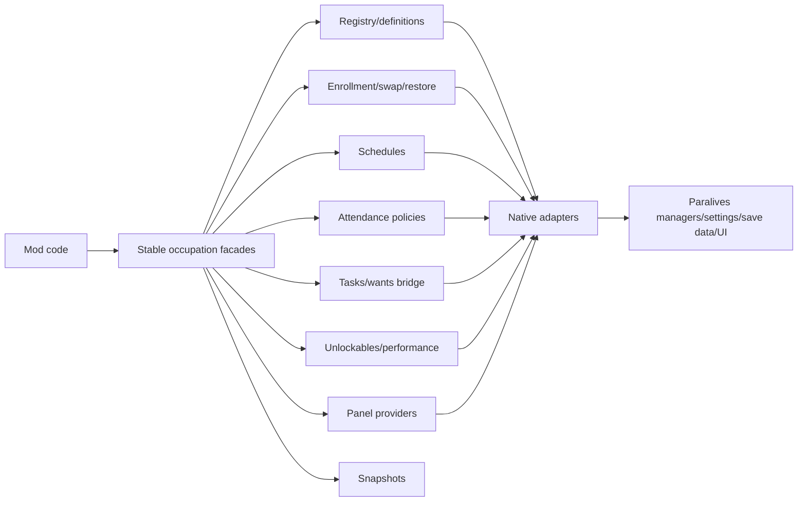

# Paralives Occupation API

> **Build/reference metadata**
> Research note created/reviewed: 2026-05-30.
> Game build represented: local Paralives managed assemblies from A:\SteamLibrary\steamapps\common\Paralives, DLL timestamps 2026-05-29 UTC.
> Assembly fingerprint: Assembly-CSharp.dll SHA256 885D46DF..., Paralives.dll SHA256 BEE83983..., Plugins.dll SHA256 311E9ED9.... Full hashes are in Decompiled/decompile-state.json.
> Metadata added: 2026-05-30.

Date reviewed: 2026-05-29

Scope: current `ParalivesAPI` occupation-related surfaces and the target shape for a generic occupation API. This document is architecture guidance for the in-progress refactor. Proposed items are not public API until code lands.

## Direction

The occupation API is occupation-first. School is one specialization of the same occupation system, not the root abstraction.

The public API must support jobs, schools, custom careers, clubs, apprenticeships, gigs, remote work, training programs, volunteer work, side hustles, and similar systems. It must not introduce hardcoded Homeschool APIs or mod-specific names. A homeschool mod can be an example consumer of the generic attendance and task APIs, but the facade names, capability names, DTOs, and verifier rules should remain generic.

## Current State

Current implemented entry points are mixed stable/native surfaces under `ParalivesAPI.Core` plus expanding Stable namespace scaffolding. The Stable interfaces describe the intended split, but not every interface has a complete concrete implementation wired through `ParalivesRuntimeInfo.Current`.

| Area | Current surface | Current status |
|------|-----------------|----------------|
| Runtime access | `ParalivesRuntimeInfo.Current.Occupations` | Implemented concrete facade. Mixed stable/native signatures. |
| Stable scaffold | `ParalivesAPI.Stable.IParalivesOccupations` plus `IParalivesOccupationRegistry`, `IParalivesOccupationEnrollment`, `IParalivesOccupationSchedules`, `IParalivesOccupationTasks`, `IParalivesOccupationUnlockables`, `IParalivesOccupationAttendancePolicies`, and `IParalivesOccupationPanelProviders` | Interface scaffolding exists. It is the target contract direction, but current Core facades are not fully adapted to every interface. |
| Registry | `ParalivesOccupationRegistry`, `ParalivesOccupationDefinition`, `ParalivesOccupationRegistrationResult`, `Occupations.Registry`, `Occupations.RegisterOccupation(...)`, `Occupations.ApplyWhenReady()` | Implemented Core registration path that converts API definitions to native `Setting.Occupation` and applies them when settings are ready. |
| Occupation reads | `GetActiveOccupationIndexes(...)`, `GetOccupationSummary(...)`, `GetScheduleStatus(...)`, `IsSchool(...)` | Implemented. GUID/snapshot overloads are the safer public direction. |
| Enrollment and removal | `ParalivesOccupationEnrollmentFacade`, `Occupations.Enrollment`, `TryEnroll(...)`, `TryUnenroll(...)`, `TrySwap(...)`, `TryRestore(...)`, `ParalivesOccupationEnrollmentOptions`, `ParalivesOccupationEnrollmentResult`, `ParalivesOccupationRestoreToken`, legacy `Enroll(...)` / `Unenroll(...)` helpers | Implemented Core enrollment/swap/restore facade and legacy helpers. Some overloads still use native schedule types. |
| Performance and upgrades | `SetPerformance(...)`, `GrantUpgrade(...)`, `TryGrantExtraUnlockable(...)`, expertise helpers, pending-upgrade helpers | Implemented in Core. Unlockable/expertise APIs still expose native save data on some overloads. |
| School helpers | `GetActiveSchoolIndexes(...)`, `TryFindActiveSchool(...)`, `SuppressSchoolAttendanceToday(...)` | Implemented as specialization helpers. They should remain small convenience helpers over the generic occupation model. |
| Schedules | `ParalivesOccupationScheduleFacade`, `ParalivesOccupationScheduleDefinition`, schedule option/snapshot DTOs, `Occupations.Schedules` | Implemented Core schedule registration and read helpers. Some DTO properties still use native schedule types. |
| Attendance policies | `ParalivesAttendancePolicyRegistry`, `ParalivesAttendancePolicy`, `ParalivesOccupationAttendanceDecisionPolicy`, `ParalivesOccupationAttendanceDecision`, `ParalivesOccupationScheduleContext` | Implemented. The context currently exposes raw `AssetCharacter`, occupation save data, native schedule values, and `Setting.Occupation`; stable wrappers are still target work. |
| Attendance patch | `OccupationsManagerShouldBeWorkingNowPatch` | Implemented optional patch that lets registered policies override physical attendance for any occupation. |
| Content snapshots | `ParalivesContentFacade.ReadOccupation(...)`, `ReadOccupations()` and `ParalivesOccupationContentSnapshot` | Implemented read-only setting snapshots. |
| Tasks bridge | `ParalivesOccupationTaskFacade`, `ParalivesOccupationTaskDefinition`, task entry/result DTOs, `Occupations.Tasks`, `ParalivesWantFacade.CreateOrRefreshOccupationWant(...)`, UI task animation helper | Implemented Core occupation task facade over active wants. |
| Unlockables | `ParalivesOccupationUnlockableFacade`, `Occupations.Unlockables`, read/mutation result DTOs, extra/expertise/pending-upgrade helpers | Implemented Core unlockable facade plus legacy helpers. |
| UI panels | `IParalivesOccupationPanelProvider`, `ParalivesOccupationPanel`, `ParalivesOccupationPanelRow`, `IParalivesOccupationPanelProviders`, registration through `ParalivesRuntimeInfo.Current.Windows` and occupation panel-provider service | Generic row provider exists. Current build verification found project/wiring issues around `ParalivesOccupationPanelProviderService`, so treat final integration as pending. |
| People snapshots | `ParalivesPeopleFacade` activity snapshots include active occupation and school indexes | Implemented snapshot support. |

Current debt:

- `ParalivesOccupationFacade`, schedule DTOs, and attendance policy contexts still expose raw `AssetCharacter`, `AssetCharacterOccupationData`, `Occupation`, `ScheduleDaysOfWeek`, `OccupiedHours`, and other native types in public signatures.
- Stable occupation contracts are broader than the concrete Core aggregate wiring. Enrollment, schedules, tasks, attendance, and unlockable facades exist, but final `IParalivesOccupations` implementation/project-file wiring still needs verification.
- The current full build failed because `ParalivesOccupationFacade` references `ParalivesOccupationContractMapper`, which was not found in the current source tree. This is integration work for the owning occupation/API-contract agents, not a docs change.
- `ParalivesRuntimeInfo.Current.AttendancePolicies` exists separately from `ParalivesRuntimeInfo.Current.Occupations`; the target aggregate can keep this compatibility path while routing generic Stable occupation access through `Occupations.AttendancePolicies`.

## Target Shape

The final Stable API should make ordinary occupation mods work without raw `Paralives.dll` types. Native and Unsafe APIs can still exist for advanced integrations, but they should not be the default path.

Stable entry points now present in source, with remaining adapter work:

| Facade | Purpose |
|--------|---------|
| `IParalivesOccupations` / `ParalivesOccupationFacade` | Read occupation snapshots, access registry/enrollment/schedules/tasks/unlockables/attendance/panels, enroll/unenroll/swap/restore through the enrollment facade, set performance, manage upgrades, and query active state by character GUID. Current aggregate wiring still needs build verification. |
| `IParalivesOccupationRegistry` / `ParalivesOccupationRegistry` | Register or adapt occupation definitions and apply them to native occupation settings when settings are ready. |
| `IParalivesOccupationSchedules` / `ParalivesOccupationScheduleFacade` | Register schedule definitions, read schedule types, and read assigned schedules. Still uses native schedule value types in some DTO properties. |
| `IParalivesOccupationTasks` / `ParalivesOccupationTaskFacade` | Create, refresh, complete, and query occupation-related tasks over the current wants bridge. |
| `IParalivesOccupationUnlockables` / `ParalivesOccupationUnlockableFacade` | Read expertises/extras/pending upgrades and mutate extra/expertise/pending upgrade state with structured result DTOs. |
| `IParalivesOccupationAttendancePolicies` / `ParalivesAttendancePolicyRegistry` | Register generic legacy bool policies and explicit attendance decisions for any occupation. |
| `IParalivesOccupationPanelProviders` / UI extension facade | Contribute generic rows to native occupation UI without requiring mods to patch the native panel. |
| Occupation snapshots | `ParalivesOccupationSnapshot`, `ParalivesOccupationSummary`, `ParalivesOccupationContentSnapshot`, task snapshots, schedule snapshots, and restore tokens exist. Some snapshot DTOs still carry native schedule enums. |

Proposed core DTO families:

- `ParalivesOccupationDefinition`
- `ParalivesOccupationEnrollmentRequest`
- `ParalivesOccupationSwapRequest` (proposed; not found in current source)
- `ParalivesOccupationRestoreSnapshot`
- `ParalivesOccupationScheduleDefinition`
- `ParalivesOccupationScheduleStatus`
- `ParalivesOccupationTaskDefinition`
- `ParalivesOccupationTaskSnapshot`
- `ParalivesOccupationUnlockableSnapshot`
- `ParalivesAttendanceDecisionContext` (proposed stable wrapper over current context)
- `ParalivesOccupationAttendanceDecision`
- `ParalivesOccupationPanelContext`

Do not use `Homeschool` in these names. A homeschool implementation should be expressed as a school occupation with an attendance policy, tasks, panel rows, and optional restore state.

## Facade Map

| Responsibility | Current implementation | Stable target | Native/Unsafe boundary |
|----------------|------------------------|---------------|------------------------|
| Registry | `ParalivesOccupationRegistry`, `ParalivesOccupationDefinition`, and `ParalivesContentFacade.ReadOccupation(...)`. | Register/read API-owned occupation definitions and map them to native setting content. | Raw `Setting.Occupation`, generated setters, and setting array mutation belong under Native until wrapped. |
| Enrollment | Legacy `ParalivesOccupationFacade.Enroll(...)` and `Unenroll(...)`; `IParalivesOccupationEnrollment` scaffold for `TryEnroll`, `TryUnenroll`, `TrySwap`, and `TryRestore`. | GUID-based enrollment, unenrollment, swap, and restore requests with structured results. | Native character overloads and native schedule enums should move or be duplicated under Native. |
| Schedules | `ParalivesOccupationScheduleFacade`, `GetScheduleStatus(...)`, and native schedule checks internally. | API-owned schedule DTOs and read-only status snapshots. | Native `ScheduleDaysOfWeek`, `OccupiedHours`, and manager calls stay behind adapters. |
| Tasks | `ParalivesOccupationTaskFacade`, `ParalivesWantFacade.CreateOrRefreshOccupationWant(...)`, goals/wants events, `Windows.AnimateNewOccupationTask(...)`. | Dedicated occupation task facade over wants/goals with stable task snapshots. | Raw want data, generated `Setting.Want`, and UI animation internals stay out of Stable. |
| Unlockables | Extra/expertise helpers on `ParalivesOccupationFacade`; `IParalivesOccupationUnlockables` scaffold. | Stable unlockable definitions, snapshots, and command results. | Raw `OccupationUnlockable` and occupation save-data lists remain Native. |
| AttendancePolicies | `ParalivesAttendancePolicyRegistry` with legacy bool policies and `ParalivesOccupationAttendanceDecisionPolicy`. | Stable attendance decision context using character/occupation IDs and snapshots only. | Raw `AssetCharacter`, occupation save data, native schedule values, and `Setting.Occupation` context properties become Native-only or compatibility members. |
| PanelProviders | `IParalivesOccupationPanelProvider`, `ParalivesOccupationPanel`, `ParalivesOccupationPanelRow`. | Generic panel provider context and rows/sections. | Native `UIOccupations` patch plumbing stays internal/Unsafe. |
| Snapshots | `ParalivesOccupationSummary`, `ParalivesOccupationContentSnapshot`, people activity snapshots. | Immutable, complete snapshots for content, enrollment, attendance, tasks, unlockables, and restore state. | Raw live objects are excluded from Stable snapshots. |

## System Connections



## Responsibility Split

| Component | Owns | Does not own |
|-----------|------|--------------|
| Registry | Occupation definitions, stable IDs, localization keys, declared schedule/task/unlockable metadata, capability discovery. | Live character enrollment state or attendance decisions. |
| Enrollment | Adding/removing active occupations, swap/restore workflows, save-dirty marking, structured failure results. | Definition authoring or UI rendering. |
| Schedules | Schedule DTOs, current schedule status, calendar/time interpretation, schedule diagnostics. | Policy decisions that override attendance. |
| Tasks | Occupation tasks and task state over wants/goals, task completion helpers, task refresh/expiry policy. | Raw `Want` authoring unless routed through a content registry. |
| Unlockables | Extras, expertise, upgrades, performance result snapshots, stable unlockable reads/mutations. | Schedule evaluation or attendance suppression. |
| AttendancePolicies | Should-attend decisions for any occupation type, including remote-work and offsite-training cases. | Enrollment mutation or task creation. |
| PanelProviders | Additive occupation UI rows/sections and text/localization payloads. | Native window lifecycle, prefab injection, or direct UI object mutation. |
| Snapshots | Read-only, immutable API-owned views of current occupation content and state. | Holding live native objects. |

## Stable, Native, Unsafe Rules

Stable occupation APIs:

- Use character GUIDs, occupation GUIDs, indexes, primitive values, strings, immutable snapshots, and API-owned request/result DTOs.
- Avoid raw `AssetCharacter`, `AssetCharacterOccupationData`, `Setting.Occupation`, `ScheduleDaysOfWeek`, `OccupiedHours`, `UIOccupations`, and generated setting/save-data types.
- Return `false`, empty arrays, or structured result objects when managers/settings are unavailable.
- Mark affected character/save data dirty after save-backed mutation.
- Name school helpers as school specialization helpers only when the behavior is genuinely school-specific.

Native occupation APIs:

- May expose live character objects, generated occupation settings, native schedule enums, and native occupation save data.
- Must be named and documented as raw access.
- Should not be required for common jobs, schools, clubs, gigs, remote work, or task mods.

Unsafe occupation APIs:

- Cover private UI methods, Harmony patch targets, reflection, and direct manager internals.
- Must document failure modes and should not appear in ordinary examples.

## Examples

Generic part-time job:

```csharp
ParalivesRuntimeInfo.Current.Occupations.Enroll(
    characterGuid,
    jobOccupationGuid,
    selectedDays,
    selectedHours,
    startingRank: 0);
```

This is current Core usage but still includes native schedule enum types. The Stable target should wrap the schedule in an API-owned request DTO.

Club attendance policy:

```csharp
IDisposable registration = ParalivesRuntimeInfo.Current.AttendancePolicies.Register(context =>
{
    if (context.OccupationGuid != clubOccupationGuid)
        return null;

    return ShouldAttendClubMeeting(context.CharacterGuid, context.DayOfWeek);
});
```

This uses the current generic attendance registry. In the target Stable shape, the context should expose only IDs and snapshots.

Apprenticeship task:

```csharp
ParalivesRuntimeInfo.Current.Occupations.Tasks.AssignTask(
    characterGuid,
    apprenticeshipOccupationGuid,
    practiceTaskWantGuid,
    skillGuid);
```

This uses the current occupation task facade. Internally it still bridges to active wants.

Remote work:

```csharp
ParalivesRuntimeInfo.Current.AttendancePolicies.Register(context =>
{
    if (context.OccupationGuid != remoteWorkOccupationGuid)
        return null;

    return false;
});
```

The policy suppresses physical attendance for that occupation while task/performance systems can still run separately.

School specialization:

```csharp
bool isSchool = ParalivesRuntimeInfo.Current.Occupations.IsSchool(occupationGuid);
```

School helpers are valid when the behavior depends on the game's school type. Keep them small and layered over the generic occupation APIs.

Homeschool example:

```csharp
ParalivesRuntimeInfo.Current.AttendancePolicies.Register(context =>
{
    if (!context.IsSchool || !IsManagedByThisMod(context.CharacterGuid))
        return null;

    return false;
});
```

This is intentionally just an example. The API should not add `Homeschool` facade, DTO, capability, or method names.

## Verification

`tools/Verify-ParalivesApiSurface.ps1` should guard the occupation boundary by reporting:

- public `Homeschool` names under `ParalivesAPI.Core`, `ParalivesAPI.Stable`, `ParalivesAPI.Native`, or `ParalivesAPI.Unsafe`;
- Stable interface signatures that expose raw `global::AssetCharacter`, `Setting.*`, native `UI*` types, or other raw game types;
- existing raw game type exposure outside Native/Unsafe namespaces.

These checks are reporting-only by default. Do not modify source code just to silence current raw exposure findings during this documentation pass.
