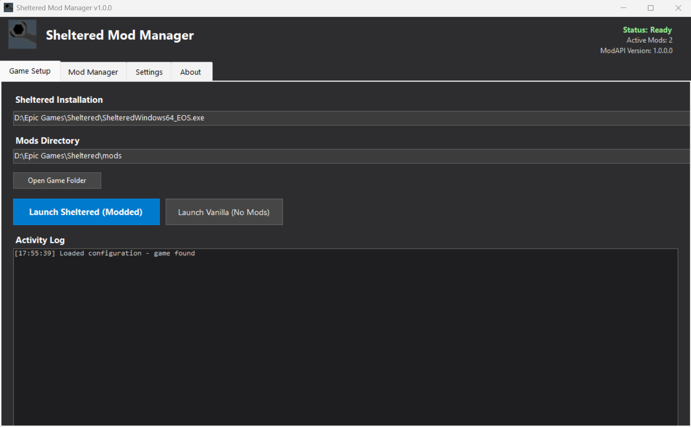
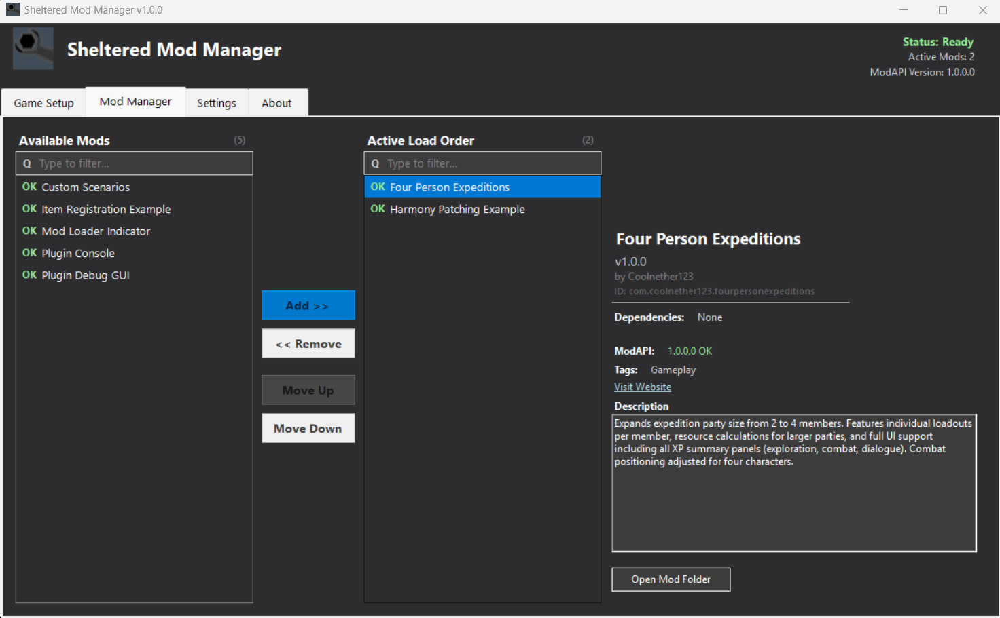

# Sheltered Mod Manager v1.2.1

**A modding framework for [Sheltered](https://store.steampowered.com/app/356040/Sheltered/) by Unicube & Team17**

[](https://opensource.org/licenses/MIT)
[]()

> **Credit:** Originally created by benjaminfoo (2019)  
> **Maintained by:** Coolnether123 (2025-Present)

## License & attribution

This project is licensed under the MIT License (see LICENSE).

The original 2019 Sheltered mod loader foundation was created by benjaminfoo. Continued development and public redistribution are performed with the original author’s permission.

Third-party components retain their own licenses (see the Credits section).

## Legacy

This project is considered legacy because the original Sheltered mod-loader effort from 2019 was left unmaintained and never grew into an active modding framework. At the time, a Unicube developer (on Reddit as UnicubeSheltered) expressed interest in mod support, but no official framework was shipped. On the original mod-loader GitHub repo, Tiller4363 attempted in 2023 to contact benjaminfoo for guidance, but from what I can find, there was no reply and benjaminfoo deleted his reddit account.

In 2025, I (Coolnether123) discovered Sheltered and went looking for mods. The only thing I found was the abandoned mod loader, so I decided to pick it up and continue development to enable modding for the game. 

## About

Sheltered Mod Manager (SMM) is a modding framework for Sheltered that installs non-destructively alongside the game.

**Key Features:**
- **Zero-Boilerplate Mods**: New `ModManagerBase` for lightning-fast development (v1.2)
- **Mod Attributes**: Simple `[ModToggle]` and `[ModSlider]` for in-game settings (v1.2.1)
- **Spine Settings API**: Rich, interactive configuration menus (v1.2)
- **Enhanced Save System**: Per-mod isolated data and dictionary persistence (v1.2.1)
- Plugin loader with dependency resolution and load order management
- Unlimited custom save slots with mod tracking and verification
- Developer API for items, recipes, events, and Harmony patching
- Desktop and in-game mod managers
- Runtime inspector (F9) for debugging


*The Mod Manager mods tab allows you to customize your load order, resolve dependencies, and view detailed mod information.*

### New in ModAPI v1.2: Modern Developer Experience
Introducing **Zero-Boilerplate Modding** and **Spine Settings**, designed to let you focus on gameplay instead of infrastructure.

*   **ModManagerBase**: A high-level base class that handles initialization, settings, and Unity lifecycle for you.
*   **Mod Attributes**: Simple `[ModToggle]` and `[ModSlider]` widgets for rapid UI prototyping.
*   **Spine Settings API**: Professional-grade settings UI with validation, presets, and dynamic lists.
*   **Isolated Mod Persistence**: Register data objects and have them automatically saved/loaded per-slot in `mod_<id>_data.json`.

> [!TIP]
> **Feedback Wanted!** Spine is in active development. I'm looking for mod authors to test the API and provide feedback. Check out the [Spine Settings Guide](documentation/Spine_Settings_Guide.md) to get started!

The API is under active development - see the documentation for current capabilities.

## Installation

Steam/GOG users: install the 32-bit package named Steam/GOG.

Epic users: install the 64-bit package named Epic.

1. **Back up your Sheltered folder**
2.  Copy the (Steam/GOG or Epic) files into the Sheltered game directory
   (same folder as `Sheltered.exe` or `ShelteredWindows64_EOS.exe`)
3. Run `SMM\Manager.exe`
4. Enable mods and launch the game

If your exe is Sheltered.exe, you are on Steam/GOG. If it is ShelteredWindows64_EOS.exe, you are on Epic

### Installing mods
1. Download mods from *Nexus(Link)*
2. Move file into mods folder
3. If the mod is zipped unzip the folder
4. Enable in Manager.exe

# Features
### Save protection

Each save records which mods were active when it was created.

* Warns if required mods are missing
* Warns on version mismatches
* Visual status icons per save:
  * ✓ All mods match
  * ~ Version mismatch
  * ✗ Missing mods
* Save Details window shows differences
* One-click “Reload with Save Mods” option


*The in-game verification system ensures your active mod list matches your save file exactly to prevent corruption.*

### Unlimited save slots

Removes the vanilla 3-slot limit.

* Paging UI for unlimited saves
* Works alongside vanilla saves
### In-game mod manager

A “Mods” button is added to the main menu.

* View installed mods
* See versions, authors, and dependencies


*Access full mod details, versions, and descriptions directly from the Sheltered main menu.*

# Support

## Uninstall

1. Delete the `mods` and `SMM` folders
2. Remove doorstop_config.ini, SMM\mod_manager.log, and winhttp.dll
3. Verify game files via Steam/GOG/Epic if any issues arise

Your vanilla save files are not deleted.
Custom saves are stored in mods/ModAPI/... (back this folder up if you want to keep them).

## Vanilla launch note

If winhttp.dll is present, Sheltered will always start with ModAPI enabled, even when launched directly.

To start the game fully vanilla, temporarily move winhttp.dll out of the game directory, then move it back to re-enable mods.

## Compatibility

* **Game:** Sheltered 1.8+
* **Platforms:** Steam/GOG, Epic
* **Architecture:**
  * Steam/GOG: 32-bit
  * Epic: 64-bit
* **OS:** Windows 10 / 11
* **Unity:** 5.3 and 5.6+ supported

## Developer tools

### Runtime inspector

Press **F9** in-game.

* Scene hierarchy viewer
* Object picker
* Component and field inspection
* Bounds visualization

## Mod Structure

Mods follow a standardized folder layout:

```
Sheltered/
└─ mods/
    └─ MyCoolMod/                ← Mod root folder
         ├─ About/                 
         │  ├─ About.json         ← Mod metadata (REQUIRED)
         │  ├─ preview.png        ← Preview image for Manager
         │  └─ icon.png           ← Optional icon
         ├─ Assemblies/           ← Compiled mod code
         │  └─ MyCoolMod.dll
         ├─ Assets/               ← Custom content
         │  ├─ Textures/
         │  ├─ Audio/
         │  └─ Localization/
         └─ Config/               ← Configuration files
              ├─ default.json     ← Default settings
              └─ user.json        ← User overrides
```

### About.json Format

```json
{
  "id": "YourName.MyCoolMod",
  "name": "My Cool Mod",
  "version": "1.0.0",
  "authors": ["Your Name"],
  "description": "Adds cool features to Sheltered!",
  "entryType": "MyCoolMod.MyPlugin",
  "dependsOn": ["OtherAuthor.SomeMod>=2.0.0"],
  "loadBefore": ["SomeMod"],
  "loadAfter": ["CoreAPI"],
  "tags": ["QoL", "Items"],
  "website": "https://nexusmods.com/sheltered/mods/123",
  "missingModWarning": "This save uses custom items that will be lost!"
}
```

**Required Fields:** `id`, `name`, `version`, `authors`, `description`

**Optional Fields:**
- `entryType` - Fully qualified class name implementing `IModPlugin`
- `dependsOn` - Array of mod IDs with optional version constraints (e.g., `">=1.0.0"`)
- `loadBefore` / `loadAfter` - Load order hints for compatibility
- `tags` - Categories for filtering (e.g., `"QoL"`, `"UI"`, `"Content"`)
- `website` - Link to your mod page or documentation
- `missingModWarning` - Custom message shown when loading a save that used this mod but it's now disabled/missing. Use this to warn players about potential data loss or gameplay issues.


## For mod authors

The Developer API is in early development. See the documentation folder for current capabilities.

Currently available:
* Item and food injection
* Custom crafting recipes
* Event subscriptions (day cycles, save/load, UI panels)
* Harmony integration for runtime patching
* Runtime inspector (F9)

Planned for future updates:
* NPC & Character manipulation
* Combat encounter events
* Quest system integration
* Faction hooks 

---

## Credits

- **Coolnether123** - 2025 Active Development & Maintenance
- **benjaminfoo** - Original 2019 mod loader foundation (used with permission)
- **[Team17](https://www.team17.com/)** - For publishing Sheltered
- **Unicube** - Original game developers
- **[NeighTools](https://github.com/NeighTools)** - UnityDoorstop injection framework
- **[Andreas Pardeike](https://github.com/pardeike)** - Harmony runtime patching library

## Support & Community

- **Issues:** [GitHub Issues](https://github.com/coolnether123/shelteredmodmanager/issues)
- **Nexus Comments:** [Sheltered Mod Manager](https://nexusmods.com/sheltered/mods/1)

## Documentation

| Guide | Description |
|-------|-------------|
| [How to Develop a Plugin](documentation/how%20to%20develop%20a%20plugin.md) | Getting started with mod development |
| [Spine Settings Guide](documentation/Spine_Settings_Guide.md) | Attribute-based settings API |
| [ModAPI Developer Guide](documentation/ModAPI_Developer_Guide.md) | Comprehensive API usage guide |
| [Events Guide](documentation/Events_Guide.md) | Game and UI event subscriptions |
| [Harmony Patches](documentation/how%20to%20develop%20a%20patch%20with%20harmony.md) | Runtime code patching |
| [API Reference](documentation/ModAPI_Documentation.md) | Technical API reference |


