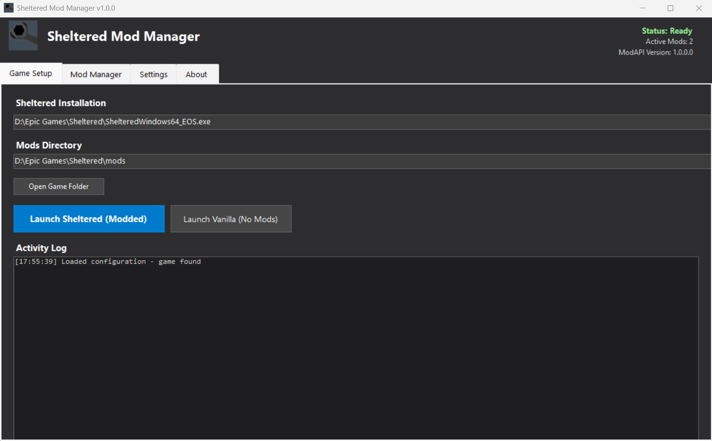
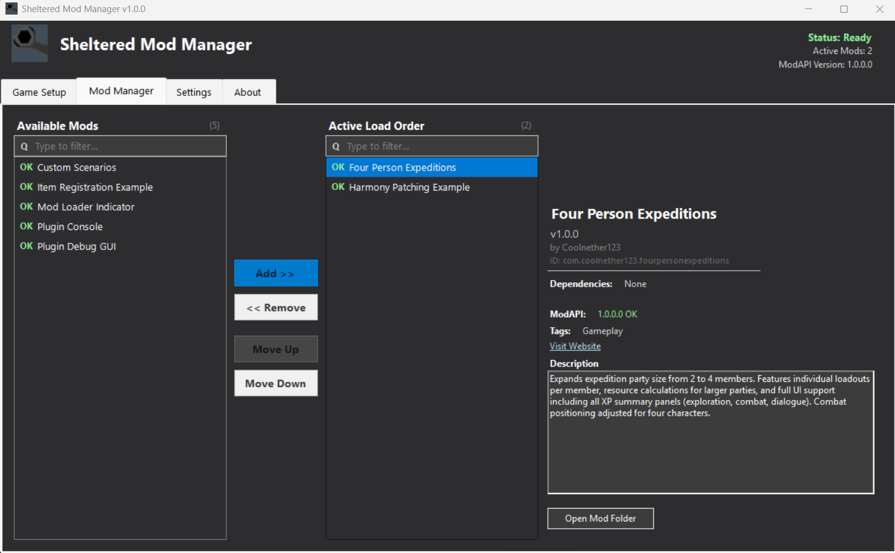
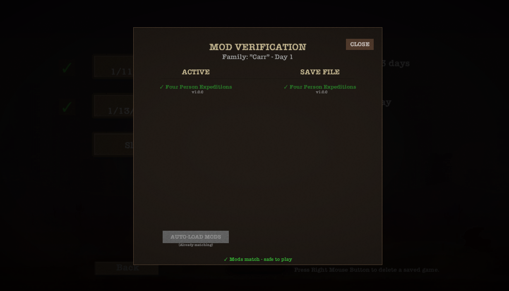
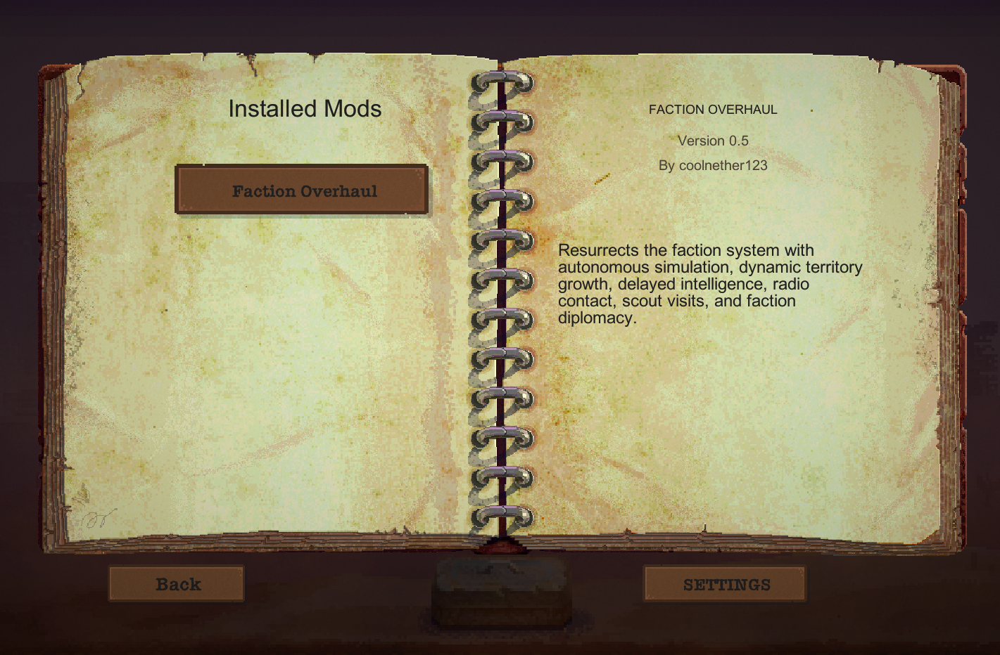

# Sheltered Mod Manager v2.0 Beta.1

**A modding framework for [Sheltered](https://store.steampowered.com/app/356040/Sheltered/) by Unicube & Team17**

[](https://opensource.org/licenses/MIT)


> **Credit:** Originally created by benjaminfoo (2019)
> **Maintained by:** Coolnether123 (2025-Present)

## License & Attribution

This project is licensed under the MIT License (see LICENSE).

The original 2019 Sheltered mod loader foundation was created by benjaminfoo. Continued development and public redistribution are performed with the original author's permission.

Third-party components retain their own licenses (see the Credits section).

## Legacy

This project is considered legacy because the original Sheltered mod-loader effort from 2019 was left unmaintained and never grew into an active modding framework. At the time, a Unicube developer (on Reddit as UnicubeSheltered) expressed interest in mod support, but no official framework was shipped. On the original mod-loader GitHub repo, Tiller4363 attempted in 2023 to contact benjaminfoo for guidance, but from what I can find, there was no reply and benjaminfoo deleted his reddit account.

In 2025, I (Coolnether123) discovered Sheltered and went looking for mods. The only thing I found was the abandoned mod loader, so I decided to pick it up and continue development to enable modding for the game.

## About

Sheltered Mod Manager (SMM) is a modding framework for Sheltered that installs non-destructively alongside the game.

**Key Features:**

- Plugin loader with dependency resolution and load order management
- Unlimited custom save slots with mod tracking and verification
- Neutral `ModAPI.dll` framework APIs plus `ShelteredAPI.dll` integration for items, recipes, events, scenarios, UI hooks, saves, input, and Harmony patching
- Experimental custom scenario browser, XML scenario packs, scenario authoring, trigger runtime, scheduled effects, and win/loss runtime support
- Rebindable Sheltered and mod-defined keybindings with conflict detection and persistence
- Zero-boilerplate mod development with `ModManagerBase`, attribute settings, and Spine settings UI
- Per-mod isolated persistence and save-backed compatibility helpers
- Desktop and in-game mod managers
- Runtime inspector (F9) for debugging


*The Mod Manager mods tab allows you to customize your load order, resolve dependencies, and view detailed mod information.*

### New in ModAPI v2.0 Beta.1

The 2.0 line is a breaking clean API line. It separates the neutral modding framework from Sheltered-specific runtime integrations and expands the in-game authoring surface.

- **ModAPI/ShelteredAPI split:** `ModAPI.dll` owns neutral contracts; `ShelteredAPI.dll` owns Sheltered content, saves, input, UI, events, actors, and scenarios.
- **Custom scenarios (experimental):** XML packs and code registrations appear in the in-game scenario browser, with dependency lockout, custom save binding, triggers, scheduled effects, and win/loss outcomes. Beta.1 testers should treat this as an active testing surface.
- **Release-gated safety fixes:** custom-scenario save APIs reject built-in save ids, scenario XML saves use temp/validate/replace with backups, Unity log filtering never suppresses errors/asserts/exceptions, and Nexus installs verify copied files before success.
- **Rebindable controls:** Vanilla Sheltered actions and mod-defined input actions share one keybinding UI with persisted bindings and conflict handling.
- **Modern developer experience:** `ModManagerBase`, attribute settings, Spine settings UI, event bus, isolated persistence, Harmony helpers, and runtime diagnostics remain supported.

> [!TIP]
> Mod authors should start with the [Documentation Index](documentation/README.md), which gives the first-mod path and the canonical ModAPI/ShelteredAPI boundary rule before linking advanced guides.

The API is in beta. See the documentation for current capabilities.

### Beta Safety Notes

This release line is a public beta, not stable 2.0. Back up saves before testing, especially when testing custom scenarios, Stasis/Surrounded expanded saves, or mods built against 1.2.2.

Family Expansion and Deep Expansion need rebuilt/tested packages before they should be listed as compatible with Beta.1. Some 1.2.2 mods may need migration because Sheltered-specific APIs moved from `ModAPI.dll` to `ShelteredAPI.dll`.

## Installation

Steam/GOG users: install the 32-bit package named Steam/GOG.

Epic users: install the 64-bit package named Epic.

1. **Back up your Sheltered folder.**
2. Copy the Steam/GOG or Epic package files into the Sheltered game directory, next to `Sheltered.exe` or `ShelteredWindows64_EOS.exe`.
3. Run `SMM\Manager.exe`.
4. Enable mods and launch the game.

If your executable is `Sheltered.exe`, you are on Steam/GOG. If it is `ShelteredWindows64_EOS.exe`, you are on Epic.

### Antivirus Note

SMM uses Unity Doorstop injection through `winhttp.dll` so it can load `SMM\Doorstop.dll` before Sheltered starts. Some antivirus tools may flag this DLL injection pattern even when the file is from the official SMM release. If that happens, verify the archive source, restore the quarantined `winhttp.dll`, and allowlist the Sheltered install folder for SMM.

### Installing Mods

1. Download Sheltered mods from [Nexus Mods](https://www.nexusmods.com/games/sheltered).
2. Move the mod folder or zip file into the `mods` folder.
3. If the mod is zipped, unzip it so the mod's `About` and `Assemblies` folders are inside one mod folder.
4. Enable it in `SMM\Manager.exe`.

## Features

### Save Protection

Each save records which mods were active when it was created.

- Warns if required mods are missing
- Warns on version mismatches
- Visual status icons per save:
  - `[OK]` All mods match
  - `~` Version mismatch
  - `[MISSING]` Missing mods
- Save Details window shows differences
- One-click "Reload with Save Mods" option


*The in-game verification system ensures your active mod list matches your save file exactly to prevent corruption.*

### Unlimited Save Slots

Removes the vanilla 3-slot limit.

- Paging UI for unlimited saves
- Works alongside vanilla saves

### In-Game Mod Manager

A "Mods" button is added to the main menu.

- View installed mods
- See versions, authors, and dependencies


*Access full mod details, versions, and descriptions directly from the Sheltered main menu.*

## Uninstall

1. Delete the `mods` and `SMM` folders.
2. Remove `doorstop_config.ini`, `SMM\mod_manager.log`, and `winhttp.dll`.
3. Verify game files via Steam/GOG/Epic if any issues arise.

Your vanilla save files are not deleted. Custom saves are stored in `mods/ModAPI/...`; back this folder up if you want to keep them.

## Vanilla Launch Note

If `winhttp.dll` is present, Sheltered will always start with ModAPI enabled, even when launched directly.

To start the game fully vanilla, temporarily move `winhttp.dll` out of the game directory, then move it back to re-enable mods.

## Compatibility

- **Game:** Sheltered 1.8+
- **Platforms:** Steam/GOG, Epic
- **Architecture:**
  - Steam/GOG: 32-bit
  - Epic: 64-bit
- **OS:** Windows 10 / 11
- **Unity:** 5.3 and 5.6+ supported

## Developer Tools

### Runtime Inspector

Press **F9** in-game.

- Scene hierarchy viewer
- Object picker
- Component and field inspection
- Bounds visualization

### Building From Source

Use Visual Studio 2022 MSBuild for this legacy solution, not `dotnet build`.

Prerequisites:

- Visual Studio 2022 with .NET desktop build tools.
- .NET Framework 3.5 targeting support for the Manager, Doorstop, ModAPI, and ShelteredAPI projects.
- .NET 8 SDK for the decompiler helper project in the solution.
- A local Sheltered install that provides `Assembly-CSharp.dll`, `UnityEngine.dll`, and `UnityEngine.UI.dll`.

Current project files contain local `HintPath` fallbacks for the maintainer's Steam/Epic installs. If your Sheltered install is elsewhere, retarget those references locally before building.

Build command used for Dev/2.0 verification:

```powershell
& "C:\Program Files\Microsoft Visual Studio\2022\Community\MSBuild\Current\Bin\MSBuild.exe" ShelteredModManager.sln /t:Build /p:Configuration=Debug /p:Platform="Any CPU" /v:minimal
```

Before publishing, also run:

```cmd
tools\verify-modapi-boundary.cmd
tools\verify-shelteredapi-public-surface.cmd
tools\test-shelteredapi-contracts.cmd
tools\verify-runtimecompat-rect.cmd
```

## Mod Structure

Mods follow a standardized folder layout:

```text
Sheltered/
`-- mods/
    `-- MyCoolMod/                <- Mod root folder
        |-- About/
        |   |-- About.json        <- Mod metadata (REQUIRED)
        |   |-- preview.png       <- Preview image for Manager
        |   `-- icon.png          <- Optional icon
        |-- Assemblies/           <- Compiled mod code
        |   `-- MyCoolMod.dll
        |-- Assets/               <- Custom content
        |   |-- Textures/
        |   |-- Audio/
        |   `-- Localization/
        `-- Config/               <- Configuration files
            |-- default.json      <- Default settings
            `-- user.json         <- User overrides
```

### About.json Format

```json
{
  "id": "YourName.MyCoolMod",
  "name": "My Cool Mod",
  "version": "1.0.0",
  "authors": ["Your Name"],
  "description": "Adds cool features to Sheltered!",
  "entryType": "MyCoolMod.MyPlugin",
  "dependsOn": ["OtherAuthor.SomeMod>=2.0.0"],
  "loadBefore": ["SomeMod"],
  "loadAfter": ["CoreAPI"],
  "tags": ["QoL", "Items"],
  "website": "https://www.nexusmods.com/games/sheltered/mods/123",
  "missingModWarning": "This save uses custom items that will be lost!"
}
```

**Required Fields:** `id`, `name`, `version`, `authors`, `description`

**Optional Fields:**

- `entryType` - Fully qualified class name implementing `IModPlugin`
- `dependsOn` - Array of mod IDs with optional version constraints, such as `">=1.0.0"`
- `loadBefore` / `loadAfter` - Load order hints for compatibility
- `tags` - Categories for filtering, such as `"QoL"`, `"UI"`, `"Content"`
- `website` - Link to your mod page or documentation
- `missingModWarning` - Custom message shown when loading a save that used this mod but it is now disabled or missing

## For Mod Authors

Start with the [Documentation Index](documentation/README.md) and its canonical [assembly boundary](documentation/README.md#assembly-boundary-canonical). The API is split between the neutral framework (`ModAPI.dll`) and the Sheltered integration layer (`ShelteredAPI.dll`).

Currently available:

- Neutral plugin lifecycle, settings, persistence, event-bus, actor-contract, and Harmony helper APIs via `ModAPI.dll`
- Item, food, recipe, scenario, save, UI, input, event, and manager-backed hooks via `ShelteredAPI.dll`
- Event subscriptions for day cycles, save/load, UI panels, combat starts, faction events, party returns, and inter-mod messages
- Experimental custom scenario XML packs, code registrations, trigger runtime, scheduled effects, and win/loss runtime
- Rebindable vanilla and mod-defined keybindings
- Runtime inspector (F9)

---

## Credits

- **Coolnether123** - 2025 maintenance and development
- **benjaminfoo** - Original 2019 mod loader foundation (used with permission)
- **[Team17](https://www.team17.com/)** - For publishing Sheltered
- **Unicube** - Original game developers
- **[NeighTools](https://github.com/NeighTools)** - UnityDoorstop injection framework
- **[Andreas Pardeike](https://github.com/pardeike)** - Harmony runtime patching library

## Support & Community

- **Issues:** [GitHub Issues](https://github.com/coolnether123/shelteredmodmanager/issues)
- **Sheltered Mods:** [Nexus Mods - Sheltered](https://www.nexusmods.com/games/sheltered)
- **Nexus Comments:** [Sheltered Mod Manager](https://www.nexusmods.com/sheltered/mods/1)

## Documentation

Use [Documentation Index](documentation/README.md) for the ordered first-mod, advanced, API reference, and migration paths. This table covers common destinations.

| Task | Start Here |
|------|------------|
| Make your first mod | [Start Here / First Mod](documentation/README.md#start-here--first-mod) |
| Understand ModAPI/ShelteredAPI split | [Canonical Assembly Boundary](documentation/README.md#assembly-boundary-canonical) |
| Choose a Sheltered-specific facade | [When to Use ShelteredAPI](documentation/ShelteredAPI_Guide.md) |
| Add items, recipes, loot, or assets | [ShelteredAPI Content Guide](documentation/ShelteredAPI_Content_Guide.md) |
| Add settings or persisted mod data | [Settings and Persistence](documentation/SETTINGS.md) |
| Subscribe to game, UI, save, or time events | [Events Guide](documentation/Events_Guide.md) |
| Add rebindable controls | [Input Keybindings Guide](documentation/Input_Keybindings_Guide.md) |
| Author custom scenarios | [Custom Scenarios Guide](documentation/Custom_Scenarios_Guide.md) |
| Patch game code with Harmony | [Harmony Patches](documentation/how%20to%20develop%20a%20patch%20with%20harmony.md) |
| Check exact API signatures | [API Signatures Reference](documentation/API_Signatures_Reference.md) |
| Review this release | [Beta.1 Release Notes](documentation/Release_Beta.1.md) |
| Upgrade from older SMM | [SMM 2.0 Beta Migration](documentation/SMM_2.0_Beta_Migration.md) |
| Known issues | [Known Issues](documentation/Known_Issues.md) |
| Modder migration | [For Modders: 2.0 API Migration](documentation/For_Modders_2.0_API_Migration.md) |
| Nexus app registration readiness | [Nexus Official Registration Readiness](documentation/Nexus_Official_Readiness.md) |
